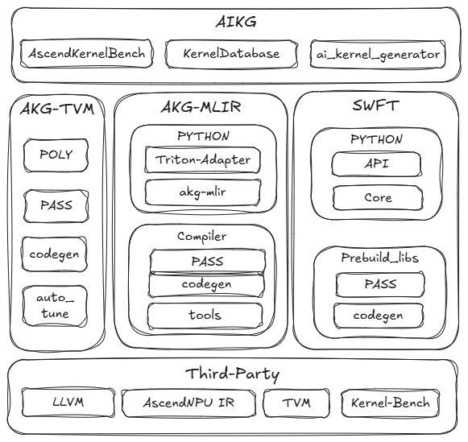

# Auto Kernel Generator (AKG)

#### 项目简介
AKG(Auto Kernel Generator)是一个深度学习编译器，用以对深度神经网络中的算子进行优化，并提供特定模式下的算子自动融合功能。
从akg 2.3版本之后，我们对AKG进行了全新升级，当前的AKG项目中，包含了AIKG、AKG-TVM、AKG-MLIR、SWFT四个子项目，支持CPU、NVIDIA、V100/A100、Atlas 800T A2/A3、300I DUO等多硬件后端的算子自动生成。

- **AIKG：** AIKG(AI Driven Kernel Generator)是我们最新孵化的一款大模型驱动的算子生成工具，提供了基于Multi-agent的算子自动生成框架、AscendKernelBench评测平台、以及算子知识库。当前支持通过LLM的方式，生成Triton-Ascend（Atalas A2/A3）以及SWFT（300I DUO）的DSL，并完成算子kernel编译。

- **AKG-TVM：** AKG-TVM保留了2.2版本以前功能和代码。提供了基于多面体调度的算子自动生成技术，支持自动向量化、自动切分、内存提升等能力，配合MindSpore图算融合功能，可提升在不同硬件后端大模型训推性能。
- **AKG-MLIR：** 基于MLIR开源项目演进的深度学习编译器，提供了CPU/GPU/Ascend上完整的算子编译Pipeline。当前包含了MindSpore Dialect图编译方言，并对Linalg、Affine、GPU等方言进行了扩展，增强了循环融合调度能力。此外，AKG-MLIR对接了AscendNPU IR，支持昇腾后端融合算子生成。
- **SWFT：** 面向300I DUO提供的算子开发工具，提供了基于Python的，符合AscendC编程习惯的，面向数据流的宏指令编程模型，通过用户指定算子融合的边界，支持大范围算子深融合/浅融合。

  

#### 安装及使用说明

AKG代码仓中的各个子项目，都支持独立安装构建，请参考各子项目使用说明。

- **AIKG：** 请参考 [AIKG](./aikg/README.md) 文档
- **AKG-TVM：**  请参考 [AKG-TVM](./akg-tvm/README.md) 文档
- **AKG-MLIR：** 请参考 [AKG-MLIR](./akg-mlir/README.md) 文档
- **SWFT：** 请参考 [SWFT](./SWFT/README.md) 文档

## 贡献

欢迎您的贡献，具体细节请参考[MindSpore贡献者Wiki](https://gitee.com/mindspore/mindspore/blob/master/CONTRIBUTING.md)。

## 版本说明

版本说明详见[RELEASE](RELEASE.md)。

## 许可证

[Apache License 2.0](LICENSE)。
