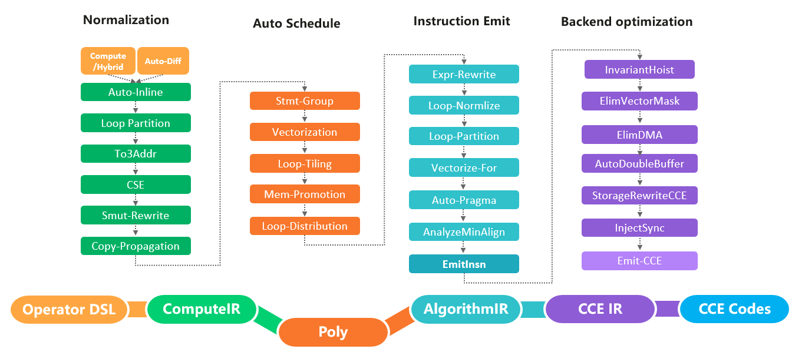

- [AKG简述](#AKG简述)
- [硬件后端支持](#硬件后端支持)
- [构建](#构建)
    - [从MindSpore侧构建](#从MindSpore侧构建)
    - [独立构建](#独立构建)
- [运行](#运行)
- [贡献](#贡献)
- [版本说明](#版本说明)
- [许可证](#许可证)

[View English](./README.md)

## AKG简述
AKG(Auto Kernel Generator)对深度神经网络中的算子进行优化，并提供特定模式下的算子自动融合功能。AKG与MindSpore的图算融合功能协同工作，可提升在不同硬件后端上运行网络的性能。

AKG由三个基本的优化模块组成：规范化、自动调度和后端优化。
- **规范化：** 为了解决polyhedral表达能力的局限性（只能处理静态的线性程序），需要首先对计算公式IR进行规范化。规范化模块中的优化主要包括自动运算符inline、自动循环融合和公共子表达式优化等。
- **自动调度：** 自动调度模块基于polyhedral技术，主要包括自动向量化、自动切分、thread/block映射、依赖分析和数据搬移等。
- **后端优化：** 后端优化模块的优化主要包括TensorCore使能、双缓冲区、内存展开和同步指令插入等。

  

## 硬件后端支持
当前支持`Ascend910`，`gpu v100/A100`等，更多硬件后端支持待开发。

## 构建

### 从MindSpore侧构建
详细细节请参考[MindSpore README.md](https://gitee.com/mindspore/mindspore/blob/master/README.md)。

### 独立构建
我们建议您从MindSpore侧构建运行AKG代码，但同时为了方便开发，我们提供了独立编译运行AKG的方式。
详细的编译依赖请参考[MindSpore安装指南](https://www.mindspore.cn/install)。
- 构建Ascend910版本

  在下载代码前需安装[git-lfs软件](https://github.com/git-lfs/git-lfs/wiki/installation)。
  ```
  git clone https://gitee.com/mindspore/akg.git
  cd akg
  bash build.sh -e ascend
  ```

- 构建GPU版本
  ```
  git clone https://gitee.com/mindspore/akg.git
  cd akg
  bash build.sh -e gpu
  ```

## 运行
1. 设置环境变量

- Ascend910
  ```
  cd tests
  source ./test_env.sh
  ```

- GPU V100/A100

  ```
  cd tests
  source ./test_env.sh gpu
  ```

2. 运行测试用例

- Ascend910
  ```
  cd tests/st/ops/ascend/vector
  pytest -s test_abs_001.py -m "level0" # 运行level0测试用例
  ```

- GPU V100/A100
  ```
  cd tests/operators/gpu
  python3 test_all.py "op_name" # 运行op_name算子测试用例
  ```

## 贡献

欢迎您的贡献，具体细节请参考[MindSpore贡献者Wiki](https://gitee.com/mindspore/mindspore/blob/master/CONTRIBUTING.md)。

## 版本说明

版本说明详见[RELEASE](RELEASE.md).

## 许可证

[Apache License 2.0](LICENSE)
