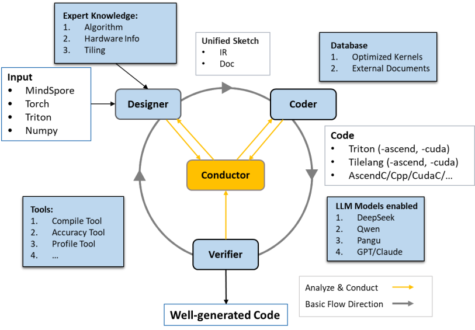

[English Version](./README.md)

<div align="center">
  
</div>

<div align="center">

# AI-driven Kernel Generator(AIKG)

</div>

<details>
<summary><b>📋 目录</b></summary>

- [AI-driven Kernel Generator(AIKG)](#ai-driven-kernel-generatoraikg)
  - [📘 1. 项目简介](#-1-项目简介)
  - [🗓️ 2. 更新日志](#️-2-更新日志)
  - [🛠️ 3. AKG_CLI 快速上手](#️-3-akg_cli-快速上手)
  - [⚙️ 4. 配置](#️-4-配置)
    - [配置快速指南](#配置快速指南)
      - [Step 1: 基础环境配置](#step-1-基础环境配置)
        - [API与模型配置](#api与模型配置)
        - [第三方依赖](#第三方依赖)
      - [Step 2: 后端依赖配置](#step-2-后端依赖配置)
      - [Step 3: 可选工具配置](#step-3-可选工具配置)
        - [文本相似性检测依赖](#文本相似性检测依赖)
  - [▶️ 5. 教程示例](#️-5-教程示例)
  - [📐 6. 设计文档](#-6-设计文档)
    - [核心框架](#核心框架)
    - [核心组件](#核心组件)
    - [服务化架构](#服务化架构)
    - [后端支持](#后端支持)

</details>

## 📘 1. 项目简介
AIKG 是一款 AI 驱动的算子生成器。
AIKG 利用大语言模型(LLM)的代码生成能力，通过大语言模型规划和控制多 Agents 协同完成多后端、多类型的AI算子生成和自动优化。
同时 AIKG 提供丰富的算子Agent相关子模块，用户可组合构建自定义算子 Agents 任务。

<div align="center" style="background-color:white">
  
</div>

## 🗓️ 2. 更新日志
- 2025-12-01：引入 LangGraph 重构任务调度系统，新增 `LangGraphTask` 替代原 `Task 任务编排` 方案。支持 Python 定义工作流、图结构可视化、类型安全状态管理，API 完全兼容原 `Task`。详见《[LangGraph 文档](./docs/CN/LangGraph.md)》。
- 2025-11-25：支持服务化架构，支持`client-server-worker`分离架构，支持各类灵活并发需求，详见《[服务化架构文档](./docs/CN/ServerArchitecture.md)》。
- 2025-10-14：支持 TileLang_CUDA后端代码生成能力。KernelBench Level1 的 TileLang_CUDA后端算子生成成功率结果详见《[基准测试结果](./docs/CN/DSLBenchmarkResults202509.md)》。
- 2025-09-26：支持 CUDA C 与 CPP 后端代码生成能力。KernelBench Level1 的 CUDA C 与 CPP 后端算子生成成功率结果详见《[基准测试结果](./docs/CN/DSLBenchmarkResults202509.md)》。
- 2025-09-14：KernelBench Level1 算子生成成功率更新，详见《[基准测试结果](./docs/CN/BenchmarkResults202509.md)》。
- 2025-08-12：支持"文档驱动式接入"功能，按统一文档规范提供资料即可快速、灵活地接入新的 DSL/前端/后端（详见《[文档驱动式接入指南](./docs/CN/DocDrivenIntegration.md)》）。
- 2025-06-27：AIKG 初始版本，支持 Triton 与 SWFT 后端代码生成能力。


## 🛠️ 3. AKG_CLI 快速上手

### 基础安装
```bash
# 1. 环境设置（可选，推荐 Python 3.10/3.11/3.12）
# 使用 conda 环境
conda create -n aikg python=3.11
conda activate aikg

# 2. 克隆仓库
git clone https://gitcode.com/mindspore/akg.git -b br_aikg
cd akg

# 3. 安装依赖
pip install -r aikg/requirements.txt
# pip install -r aikg/rag_requirements.txt  # 如果需要 RAG 功能（可选）

# 4. 安装 AIKG
pip install -e ./aikg

# 5. 设置环境变量
cd ./aikg
source env.sh
```

### API 配置示例
```bash
# 以 DeepSeek 为例，可替换为其他支持的模型服务商（详见 docs/CN/API.md）
export AIKG_BASE_URL="https://api.deepseek.com/beta/"
export AIKG_MODEL_NAME="deepseek-chat"
export AIKG_API_KEY="YOUR_API_KEY"
export AIKG_MODEL_ENABLE_THINK="enabled"  # 或 "disabled"
```

### 启动 AKG_CLI
```bash
akg_cli op \
  --framework torch \          # 前端框架：torch/mindspore/numpy
  --backend ascend \            # 后端平台：ascend/cuda/cpu
  --arch ascend910b2 \          # 硬件架构：ascend910b2/a100 等
  --dsl triton_ascend \         # 目标 DSL：triton_ascend/triton_cuda/cuda/tilelang_cuda 等
  --devices 0,1,2,3,4,5,6,7     # 可用设备列表
```

### 使用方法
启动 AKG_CLI 后，您可以通过以下方式使用：

1. **直接提问**：例如 "帮我生成个 relu 算子"
2. **提供代码**：粘贴现有的 KernelBench 风格的代码
   - AIKG 会首先编写一个 baseline torch 代码用于结果对比
   - 验证无误后，可以让它生成目标代码（生成的 DSL 类型由启动时的 `--dsl` 参数决定）

> 💡 **提示**：更多使用示例和详细说明，请参考《[AKG_CLI 文档](./docs/CN/AKG_CLI.md)》


## ⚙️ 4. 配置

### 配置快速指南

#### Step 1: 基础环境配置

##### API与模型配置
AIKG 通过环境变量来设置不同大语言模型（LLM）服务的 API。请根据您使用的服务，配置相应的环境变量：

```bash
# 各厂商API接口。详细支持列表请参考 docs/API.md
export AIKG_XXX_API_KEY=xxx

# VLLM (https://github.com/vllm-project/vllm)
export AIKG_VLLM_API_BASE=http://localhost:8000/v1

...
```

更多配置选项：
- **LangGraph 工作流配置**: 采用 LangGraph 定义任务执行流程，支持 Python 代码定义图结构、状态管理与可视化。详见《[LangGraph 文档](./docs/CN/LangGraph.md)》。
  > 注：原 **任务编排方案配置（Task Orchestration Plan Configuration）** 暂时兼容，详见《[任务编排方案配置](./docs/CN/TaskOrchestrationPlan.md)》。
- **模型配置**: `llm_config.yaml` 中预设了多种 LLM 服务商的模型配置（DeepSeek、Qwen、Moonshot 等）。
- **文档驱动式接入 (Doc-Driven Integration)**: 通过配置 `docs_dir` 为各 Agent 提供参考文档目录。详见《[文档驱动式接入指南](./docs/CN/DocDrivenIntegration.md)》。

详细配置说明请参考 [API配置文档](./docs/CN/API.md)。

##### 第三方依赖
本项目使用 git submodule 管理部分第三方依赖（如： Kernelbench、MultiKernelbench等）。

初次克隆或拉取更新后，请使用以下命令初始化并下载 `aikg` 相关的依赖：
```bash
# 初始化并拉取 aikg 相关的子模块
git submodule update --init "aikg/thirdparty/*"
```

#### Step 2: 后端依赖配置
根据您的硬件平台选择相应的后端：

| 平台 | 后端 | 参考链接 |
|------|------|----------|
| 华为Atlas A2训练系列产品 | Triton | https://gitee.com/ascend/triton-ascend |
| NVIDIA GPU | Triton | https://github.com/triton-lang/triton |
| 华为Atlas推理系列产品 | SWFT | https://gitee.com/mindspore/akg/tree/br_aikg/swft |
| NVIDIA GPU | TileLang | https://github.com/tile-ai/tilelang |
| 华为Atlas A2训练系列产品 | TileLang | https://github.com/tile-ai/tilelang |
| NVIDIA GPU | CUDA C/C++ | https://docs.nvidia.com/cuda/ |

#### Step 3: 可选工具配置

##### 文本相似性检测依赖（RAG-related）
文本句子相似性检测工具text2vec-large-chinese： 若无法自动加载模型，需要手动下载到thirdparty目录下
将下载后的模型地址添加到database对应的yaml中，请参考  [DataBase](./docs/CN/Database.md) 文档
```bash
bash download.sh --with_local_model
```

> 💡 **配置提示**: 
> - 详细的API配置请参考 [API文档](./docs/CN/API.md) 
> - 数据库配置请参考 [DataBase文档](./docs/CN/Database.md)
> - 更多配置选项请参考各组件的专门文档


## ▶️ 5. 教程示例

以下为 `examples/` 目录中的常用示例：

| 示例 | 说明 |
|------|------|
| `run_torch_npu_triton_single.py` | 单算子示例（Torch + Triton，Ascend）。 |
| `run_torch_evolve_triton.py` | 进化算法算子优化示例（Torch + Triton）。 |
| `run_numpy_swft_relu.py` | SWFT ReLU 示例（Ascend 310P3）。 |
| `run_numpy_swft_swiglu.py` | SWFT SwiGLU 示例（Ascend 310P3）。 |
| `run_cuda_to_ascend_conversion.py` | CUDA 到 Ascend 算子转换示例。 |
| `run_client_server_worker.py` | Client-Server 分布式运行示例。 |
| `kernel_profile.py` | 算子性能 Profiling 示例。 |
| `handwrite_optimization_analyzer.py` | 手写优化分析器示例。 |

更多上手流程与参数说明，请参考《[Tutorial](./docs/CN/Tutorial.md)》。


## 📐 6. 设计文档

> 建议先阅读《[LangGraph 文档](./docs/CN/LangGraph.md)》，了解最新的任务编排方案；工作流细节见《[Workflow](./docs/CN/Workflow.md)》，文档规范见《[文档驱动式接入指南](./docs/CN/DocDrivenIntegration.md)》。

### 核心框架
- **[LangGraph Task](./docs/CN/LangGraph.md)** - 任务管理模块 (LangGraph 新版)
- **[Trace](./docs/CN/Trace.md)** - 执行追踪模块  
- **[TaskPool](./docs/CN/TaskPool.md)** - 任务池管理
- **[DevicePool](./docs/CN/DevicePool.md)** - 设备池管理
- **[DataBase](./docs/CN/DataBase.md)** - 数据库模块

### 核心组件
- **[Designer](./docs/CN/Designer.md)** - 算子设计器
- **[Coder](./docs/CN/Coder.md)** - 代码生成器
- **[Verifier](./docs/CN/Verifier.md)** - 验证器
- **[Conductor](./docs/CN/Conductor.md)** - 任务编排器

### 服务化架构
- **[Server Architecture](./docs/CN/ServerArchitecture.md)** - 服务化架构文档，包含 Client-Server-Worker 架构、WorkerManager 负载均衡、便捷函数使用等

### 后端支持
- **[Triton Backend (Ascend/CUDA)](./docs/CN/Triton.md)** - Triton 计算后端
- **[TileLang Backend (Ascend/CUDA)](./docs/CN/DSLBenchmarkResults202509.md)** - TileLang 计算后端
- **[CUDA C/C++ Backend](./docs/CN/DSLBenchmarkResults202509.md)** - CUDA Native 后端
- **[SWFT Backend](./docs/CN/SWFT.md)** - 华为Atlas推理系列后端
- **[CPU Backend](./docs/CN/DSLBenchmarkResults202509.md)** - CPU 后端
