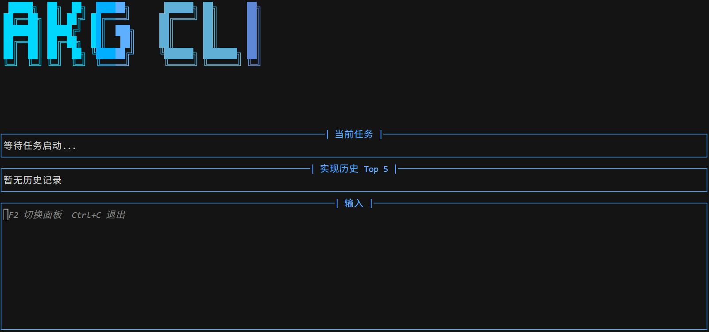
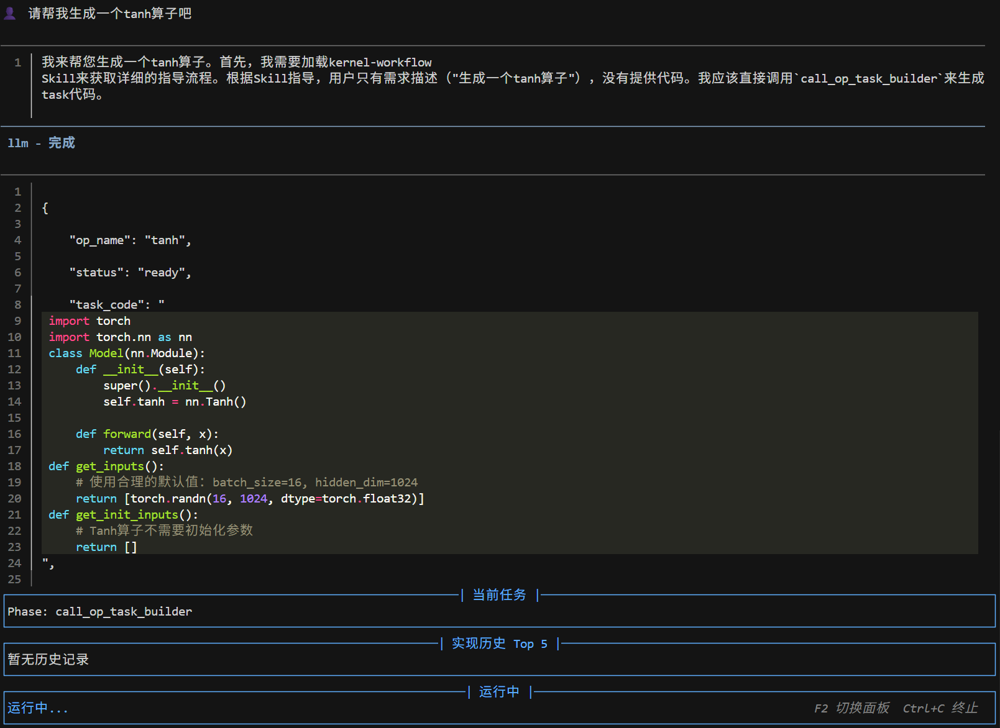
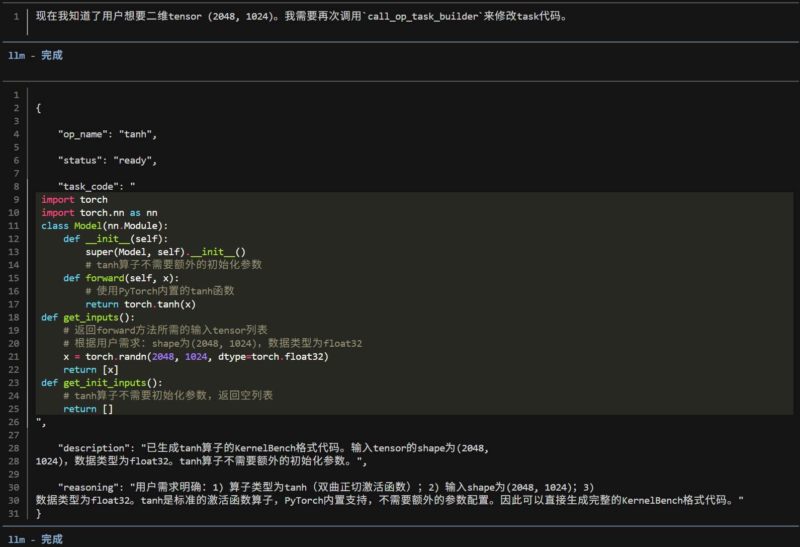
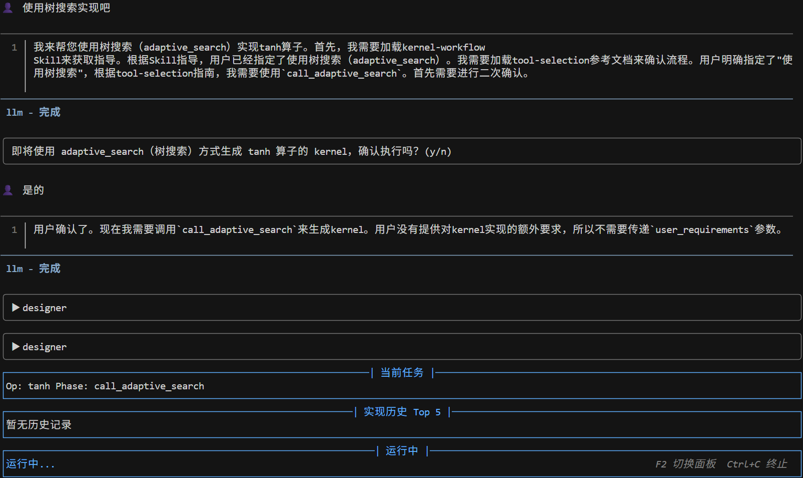
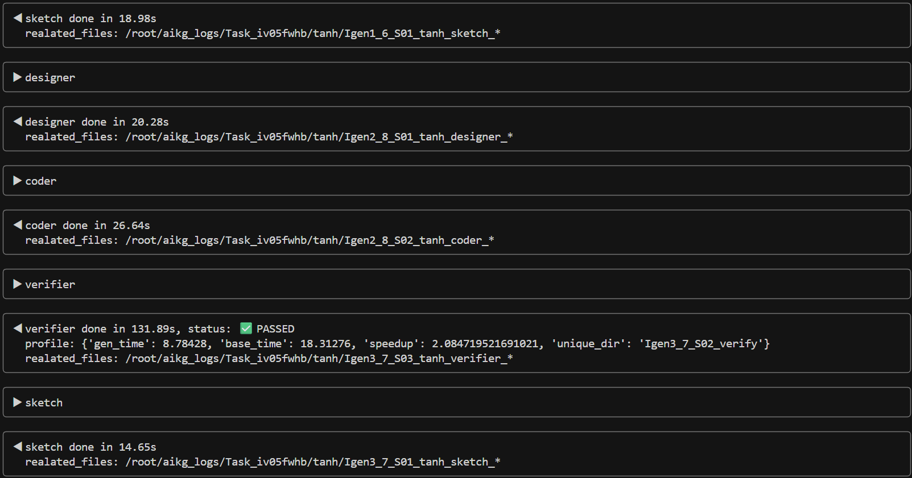
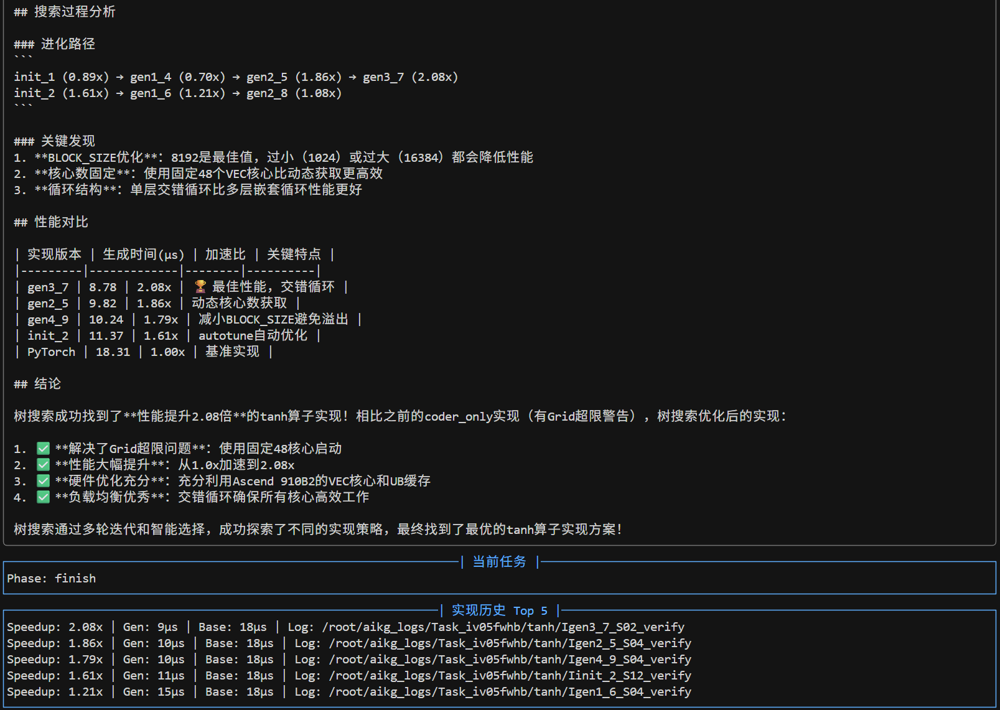
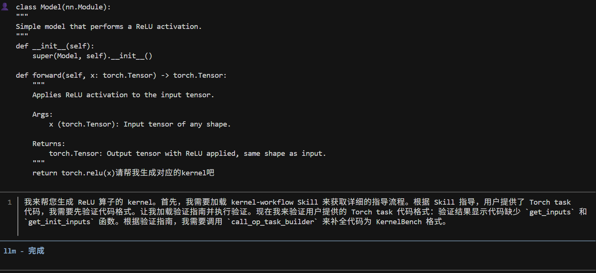
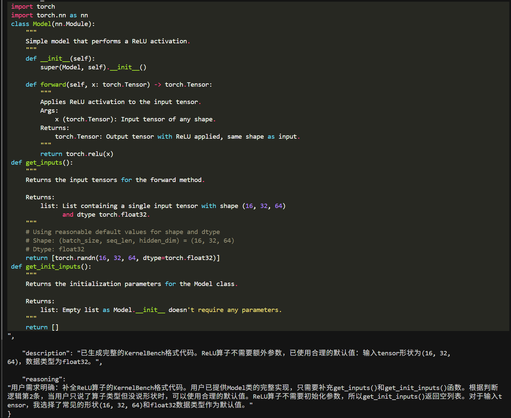

# 使用说明
启动 AKG_CLI 后，您可以看到以下 AKG_CLI 启动界面，然后请通过以下方式使用：
---

## 方式一：直接提问，与 CLI 直接交流，提出任务
### 步骤1：在输入框提出任务，点击回车，然后 CLI 就会开启思考帮您创建 task 代码，生成结束之后会询问用户接下来的需求

---
### 步骤二：修改并确认task
如果用户对task的创建不满意，可以调整输入的shape大小，数据类型等

### 步骤三：kernel生成与总结
我们提供了三种kernel的生成方式：
 - CoderOnly：标准的coder流程
 - Evolve：进化搜索，生成的kernel较coderonly流程的结果性能更佳
 - Adaptive Search：自适应搜索，选择策略的异步流水线搜索框架

**温馨提示**： 如果您对我们的 kernel 生成方式感兴趣，请查看《[Evolve](./Evolve.md)》、《[Adaptive Search](./Search.md)》。

1. 请选择您需要的生成方式，并做出确认，即可开启kernel生成

---
2. kernel生成过程
在这里您能看到Agent执行的过程以及结果文件存储路径等信息

---
3. kernel生成结果
生成结束之后会展示选择的kernel生成的结果以及总结等信息，例如：我们选择的Adaptive Search的结果如下：

## 方式二：直接粘贴现有的 KernelBench 风格的代码作为baseline，AIKG会根据输入的task，校验并修正 baseline task 代码用于结果对比。

举例说明：
1. 我们输入一个task代码：

---
2. 修正后的结果如下，这个task将用于后面的kernel生成

 - **说明**：后续的kernel生成流程相信您已经掌握方式一中介绍的用法了，请参考使用。
 - **提示**：AKG_CLI会持续更新与维护，如果您有宝贵的建议，[请提issue](https://atomgit.com/mindspore/akg/issues)。
