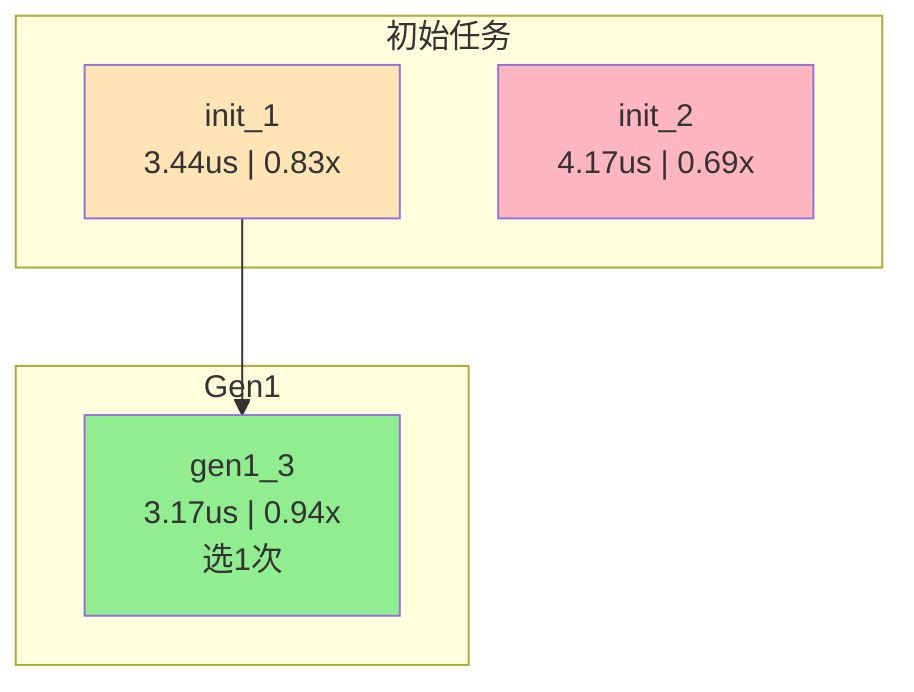

# AIKG 自适应搜索 (Adaptive Search)

## 1. 概述

自适应搜索模块是一个基于 **UCB (Upper Confidence Bound)** 选择策略的异步流水线搜索框架，用于替代原有的岛屿/精英进化算法。

### 1.1 核心特点

| 特性 | evolve (岛屿/精英) | adaptive_search |
|------|-------------------|-----------------|
| 执行模式 | 同步轮次（等待所有任务完成） | **异步流水线**（任务完成立即补充） |
| 父代选择 | 精英池 + 随机选择 | **UCB 选择**（性能 + 探索平衡） |
| 失败处理 | 保留信息 | **丢弃**（只保留成功任务） |

### 1.2 设计目标

1. **提高资源利用率**：异步流水线，无等待浪费
2. **智能父代选择**：UCB 策略平衡探索与利用
3. **简化逻辑**：只存成功任务，丢弃失败任务
4. **持续探索**：DB 为空时继续生成初始任务

---

## 2. 架构设计

### 2.1 核心组件

```
┌─────────────────────────────────────────────────────────────────┐
│                        搜索控制器 (Controller)                    │
└─────────────────────────────────────────────────────────────────┘
        │                    │                    │
        ▼                    ▼                    ▼
┌───────────────┐   ┌───────────────┐   ┌───────────────┐
│   任务池       │   │   等待队列     │   │   Success DB  │
│  (运行中任务)   │   │  (待运行任务)  │   │  (成功任务库)  │
│  max=并发数    │   │  FIFO 队列    │   │  UCB统计信息   │
└───────────────┘   └───────────────┘   └───────────────┘
        │                    ▲                    │
        │                    │                    │
        ▼                    │                    ▼
┌───────────────┐            │           ┌───────────────┐
│  任务完成      │────────────┘           │  UCB 选择器   │
│  + 性能测试    │                        │  (性能+次数)   │
└───────────────┘                        └───────────────┘
        │                                        │
        ▼                                        ▼
   成功 → 加入 DB                         ┌───────────────┐
   失败 → 丢弃                            │  任务生成器    │
                                         │  - 层次化灵感   │
                                         │  - meta_prompts │
                                         │  - handwrite    │
                                         └───────────────┘
```

### 2.2 文件结构

```
ai_kernel_generator/core/adaptive_search/
├── __init__.py           # 模块导出
├── success_db.py         # SuccessDB, SuccessRecord - 成功任务数据库
├── task_pool.py          # AsyncTaskPool, PendingTask, TaskResult - 异步任务池
├── ucb_selector.py       # UCBParentSelector - UCB 父代选择器
├── task_generator.py     # TaskGenerator - 任务生成器（复用现有组件）
├── controller.py         # AdaptiveSearchController - 搜索控制器
└── adaptive_search.py    # 主入口函数
```

---

## 3. UCB 选择策略

### 3.1 UCB 公式

$$UCB(s) = Q(s) + c \cdot \sqrt{\frac{\ln (N_{total}+1)}{N(s) + 1}}$$

其中：
- **Q(s)**: 质量得分，基于**排名**计算（Rank-based）
- **N(s)**: 该节点被选择的次数
- **N_total**: 全局总选择次数
- **c**: 探索系数（默认 √2 ≈ 1.414）

### 3.2 质量得分计算（Rank-based）

$$Q(s) = \frac{n - rank}{n - 1}$$

其中：
- **n**: DB 中记录总数
- **rank**: 当前任务按 gen_time 升序的排名（1 = 最佳）

**Rank-based 的优势**：
- **量纲无关**：Q 值固定在 [0, 1]，不受算子性能量级影响
- **区分度好**：rank=1 → Q=1.0，rank=n → Q=0.0
- **跨算子一致**：无论 ReLU (3us) 还是 Matmul (300us)，选择行为一致

### 3.3 探索项计算

$$E(s) = c \cdot \sqrt{\frac{\ln (N_{total}+1)}{N(s) + 1}}$$

- 使用 `N(s)+1` 作为分母，避免除零
- 未被选过的任务 (N(s)=0) 会有较大但**有限**的探索值
- 不会无条件优先选择未被选过的任务

### 3.4 选择计数的更新策略

采用"乐观更新 + 失败回滚"策略：

1. **选择时 +1**：选择父代时，立即 `selection_count += 1`
2. **失败时 -1**：如果该批次生成的**所有子任务都失败**，则 `selection_count -= 1`

这样既保证了及时更新探索项，又避免因子任务失败而"冤枉"惩罚父代。

### 3.4 选择示例

```
DB 中的记录（n=4）：
┌────────────────────────────────────────────────────────────────┐
│ ID     │ gen_time │ rank │ Q(s)  │ count │ E     │ UCB   │
├────────────────────────────────────────────────────────────────┤
│ task_1 │ 0.5ms    │  1   │ 1.00  │   5   │ 0.60  │ 1.60  │ ← 性能最好
│ task_4 │ 0.6ms    │  2   │ 0.67  │   3   │ 0.73  │ 1.40  │
│ task_2 │ 0.8ms    │  3   │ 0.33  │   1   │ 0.95  │ 1.28  │
│ task_3 │ 1.2ms    │  4   │ 0.00  │   0   │ 1.34  │ 1.34  │ ← 未被选过
└────────────────────────────────────────────────────────────────┘
结论：task_1 的 UCB 最高（1.60），被选中
```

---

## 4. 主循环流程

```
┌─────────────────────────────────────────────────────────────────┐
│                           初始化阶段                              │
│  1. 生成 initial_task_count 个初始任务（无灵感）                    │
│  2. 填充任务池（剩余进等待队列）                                    │
└─────────────────────────────────────────────────────────────────┘
                              ↓
┌─────────────────────────────────────────────────────────────────┐
│                            主循环                                │
│                                                                  │
│  1. 等待任意任务完成                                               │
│                                                                  │
│  2. 处理完成的任务                                                 │
│     - 成功 → 加入 Success DB                                      │
│     - 失败 → 丢弃                                                 │
│                                                                  │
│  3. 补充任务池                                                    │
│     a) 等待队列有任务 → 取出提交                                    │
│     b) DB 非空 → UCB 选父代 → 层次化灵感采样 → 生成进化任务           │
│     c) DB 为空 → 生成初始任务（继续探索）                            │
│                                                                  │
│  4. 检查停止条件：达到 max_total_tasks                             │
└─────────────────────────────────────────────────────────────────┘
                              ↓
┌─────────────────────────────────────────────────────────────────┐
│                           收集结果                               │
│  返回最佳实现、统计信息等                                          │
└─────────────────────────────────────────────────────────────────┘
```

---

## 6. 配置参数

### 6.1 并发控制

| 参数 | 类型 | 默认值 | 说明 |
|------|------|--------|------|
| `max_concurrent` | int | 8 | 任务池最大并发数 |
| `initial_task_count` | int | 8 | 初始生成的任务数 |
| `tasks_per_parent` | int | 1 | 每次选择父代后生成的任务数 |

### 6.2 UCB 选择参数

| 参数 | 类型 | 默认值 | 说明 |
|------|------|--------|------|
| `exploration_coef` | float | 1.414 | UCB 探索系数 c |
| `random_factor` | float | 0.1 | 选择时的随机扰动 |
| `use_softmax` | bool | False | 是否使用 softmax 采样 |

### 6.3 停止条件

| 参数 | 类型 | 默认值 | 说明 |
|------|------|--------|------|
| `max_total_tasks` | int | 100 | 最大总任务数（唯一停止条件） |

**停止条件行为**：
- 达到 `max_total_tasks` 后，等待所有正在运行的任务完成，然后返回结果。

### 6.4 灵感采样参数

| 参数 | 类型 | 默认值 | 说明 |
|------|------|--------|------|
| `inspiration_sample_num` | int | 3 | 灵感采样数（不含父代） |
| `handwrite_sample_num` | int | 2 | 手写建议采样数 |
| `handwrite_decay_rate` | float | 2.0 | 手写建议衰减率 |

---

## 7. 使用示例

### 7.1 基本用法

```python
from ai_kernel_generator.core.worker.manager import register_worker
from ai_kernel_generator.core.adaptive_search import adaptive_search

# 1. 注册 Worker
await register_worker(backend='cuda', arch='a100', device_ids=[0, 1])

# 2. 运行自适应搜索
result = await adaptive_search(
    op_name="my_kernel",
    task_desc=task_code,
    dsl="triton_cuda",
    framework="torch",
    backend="cuda",
    arch="a100",
    config=config,
    
    # 并发控制
    max_concurrent=4,
    initial_task_count=4,
    
    # UCB 参数
    exploration_coef=1.414,
    random_factor=0.1,
    
    # 停止条件
    max_total_tasks=50
)

# 3. 获取最佳实现
for impl in result['best_implementations']:
    print(f"gen_time: {impl['gen_time']:.4f}ms, speedup: {impl['speedup']:.2f}x")
```

### 7.2 使用命令行工具

通过 `run_single_adaptive_search.py` 脚本运行：

```bash
# 使用默认配置
python aikg/tools/run_single_adaptive_search.py

# 使用指定配置文件
python aikg/tools/run_single_adaptive_search.py config/adaptive_search_config.yaml
```

配置文件示例（`adaptive_search_config.yaml`）：

```yaml
# 任务配置
task:
  op_name: "aikg_relu"
  task_desc: "path/to/task.py"  # 任务描述文件路径

# 环境配置
environment:
  dsl: "triton_ascend"
  framework: "torch"
  backend: "ascend"
  arch: "ascend910b4"
  device_list: [0, 1]

# 并发配置
concurrency:
  max_concurrent: 4
  initial_task_count: 4
  tasks_per_parent: 1

# 停止条件
stopping:
  max_total_tasks: 50

# UCB 选择参数
ucb_selection:
  exploration_coef: 1.414
  random_factor: 0.1

# LLM 配置文件路径（必填）
config_path: "python/ai_kernel_generator/config/vllm_triton_ascend_evolve_config.yaml"
```

---

## 8. 输出结果

### 8.1 结果字典

搜索完成后返回的结果字典包含：

| 字段 | 类型 | 说明 |
|------|------|------|
| `op_name` | str | 算子名称 |
| `total_submitted` | int | 提交的任务总数 |
| `total_success` | int | 成功的任务数 |
| `total_failed` | int | 失败的任务数 |
| `success_rate` | float | 成功率 |
| `elapsed_time` | float | 总耗时（秒） |
| `stop_reason` | str | 停止原因 |
| `best_implementations` | list | 最佳实现列表（按 gen_time 排序） |
| `storage_dir` | str | 存储目录 |
| `log_dir` | str | 日志目录 |
| `lineage_graph` | str | 谱系图文件路径 |

### 8.2 谱系图

搜索完成后会自动生成任务谱系图（Mermaid 格式），保存到 Log 目录：

```
{log_dir}/{op_name}_lineage_graph.md
```

谱系图包含：
- **流程图**：展示任务的父子关系，按代数分层
- **颜色标记**：🟢 绿色=性能好，🟡 橙色=中等，🔴 红色=性能差
- **任务详情表**：包含 gen_time、speedup、父代、被选次数等信息

示例：

