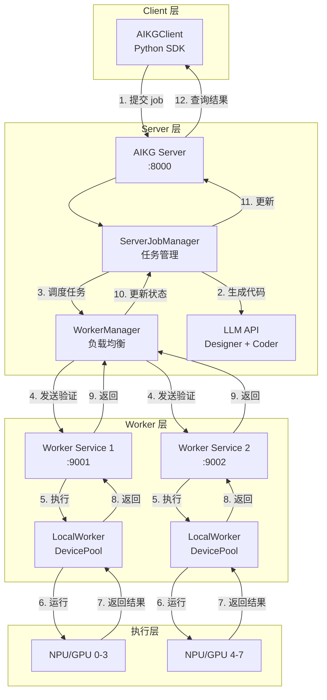
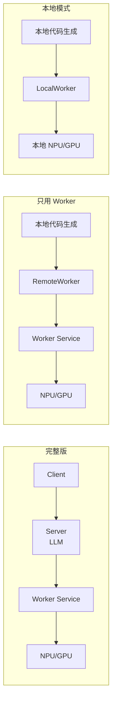

# AIKG 服务化架构

## 概述

AIKG 服务化架构将代码生成与执行验证分离，支持分布式部署和资源统一管理。

### 核心设计理念

1. **职责分离**: Server 负责代码生成，Worker 负责执行验证
2. **统一接口**: 通过 `WorkerInterface` 抽象，支持 LocalWorker 和 RemoteWorker
3. **负载均衡**: WorkerManager 自动选择最佳 Worker
4. **灵活部署**: 支持单机、分布式、混合部署模式

## 架构图

### 整体架构



## 核心组件

### 1. AIKG Server
- **职责**: 接收任务、代码生成、任务调度
- **端口**: 8000
- **功能**:
  - 接收 Client 提交的 job
  - 调用 LLM 生成代码（Designer + Coder）
  - 通过 WorkerManager 调度 Worker 执行验证
  - 管理 job 生命周期

### 2. Worker Service
- **职责**: 设备管理、执行验证和性能分析
- **端口**: 9001
- **功能**:
  - 管理本地 NPU/GPU 设备池（DevicePool）
  - 提供设备获取/释放 API（`acquire_device`/`release_device`）
  - 接收 Server 或 RemoteWorker 发送的验证任务（TAR 包）
  - 在本地 NPU/GPU 上执行验证
  - 返回执行结果

### 3. WorkerManager
- **职责**: Worker 注册、发现、负载均衡
- **功能**:
  - 管理多个 Worker 实例
  - 根据 backend/arch 选择最佳 Worker
  - 负载均衡（基于 capacity/load）
- **便捷函数**:
  - `register_local_worker()`: 一键注册 LocalWorker
  - `register_remote_worker()`: 一键注册 RemoteWorker，支持自动查询 capacity

## 使用方式对比

| 特性 | 完整版 | 只用 Worker | 本地模式 |
|------|--------|------------|---------|
| **代码生成** | Server (LLM) | 本地 | 本地 |
| **执行验证** | Worker Service | Worker Service | LocalWorker |
| **部署复杂度** | 高 | 中 | 低 |
| **适用场景** | 生产环境 | 已有代码生成 | 开发测试 |
| **网络要求** | 需要 | 需要 | 不需要 |
| **扩展性** | 高（多 Worker） | 中 | 低 |

### 架构对比



## 使用方式

### 方式 1: 完整版（Client-Server-Worker）

适用于生产环境，支持分布式部署。

#### 架构
```
Client → Server (NPU/GPU服务器:8000) → Worker Service (NPU/GPU服务器:9001) → NPU/GPU
```

#### 部署步骤

**1. 启动 Worker Service（NPU/GPU 服务器）**
```bash
cd /path/to/aikg/aikg
source env.sh
./scripts/server_related/start_worker_service.sh
```

**2. 启动 AIKG Server（NPU/GPU 服务器）**
```bash
cd /path/to/aikg/aikg
source env.sh
./scripts/server_related/start_server.sh
```

**3. 注册 Worker 到 Server**
```bash
# Ascend 后端
./scripts/server_related/register_worker_to_server.sh \
    http://localhost:8000 \
    http://localhost:9001 \
    ascend ascend910b4 1

# CUDA 后端
./scripts/server_related/register_worker_to_server.sh \
    http://localhost:8000 \
    http://localhost:9001 \
    cuda a100 1
```

**4. Client 提交任务**
```python
from ai_kernel_generator.client.aikg_client import AIKGClient

client = AIKGClient("http://localhost:8000")  # 通过 SSH 隧道

# 提交 single job (Ascend)
job_id = client.submit_job(
    op_name="relu",
    task_desc="...",
    job_type="single",
    backend="ascend",
    arch="ascend910b4",
    dsl="triton_ascend",
    framework="torch",
    workflow="coder_only_workflow"
)

# 提交 single job (CUDA)
job_id = client.submit_job(
    op_name="relu",
    task_desc="...",
    job_type="single",
    backend="cuda",
    arch="a100",
    dsl="triton_cuda",
    framework="torch",
    workflow="coder_only_workflow"
)

# 等待完成
status = client.wait_for_completion(job_id, timeout=1800)
print(f"Job 状态: {status['status']}")
print(f"结果: {status.get('result')}")

# 提交 evolve job
job_id = client.submit_job(
    op_name="relu",
    task_desc="...",
    job_type="evolve",
    backend="ascend",  # 或 "cuda"
    arch="ascend910b4",  # 或 "a100"
    dsl="triton_ascend",  # 或 "triton_cuda"
    framework="torch",
    max_rounds=2,
    parallel_num=2
)

status = client.wait_for_completion(job_id, timeout=3600)
```

#### 特点
- ✅ 代码生成与执行分离
- ✅ 支持多 Worker 负载均衡
- ✅ 支持远程部署
- ✅ 统一任务管理

### 方式 2: 只用 Worker（RemoteWorker）

适用于已有代码生成环境，只需远程执行验证。

#### 架构
```
本地代码生成 
  └─> RemoteWorker
      ├─> 1. acquire_device (HTTP) → Worker Service → DevicePool → 返回 device_id
      ├─> 2. 使用 device_id 生成验证脚本
      ├─> 3. verify/profile (HTTP) → Worker Service → 执行脚本 → NPU/GPU
      └─> 4. release_device (HTTP) → Worker Service → DevicePool
```

#### 使用示例

**1. 启动 Worker Service（NPU/GPU 服务器）**
```bash
cd /path/to/aikg/aikg
source env.sh
./scripts/server_related/start_worker_service.sh
```

**2. 本地使用 RemoteWorker**

**方式 A: 使用便捷函数（推荐）**
```python
from ai_kernel_generator.core.worker.manager import register_remote_worker
from ai_kernel_generator.core.task import Task

# 方式 1: 从环境变量读取 worker_url，自动查询 capacity
export AIKG_WORKER_URL=http://localhost:9001  # 通过 SSH 隧道
await register_remote_worker(backend="ascend", arch="ascend910b4")

# 方式 2: 显式指定 worker_url
await register_remote_worker(
    backend="ascend",
    arch="ascend910b4",
    worker_url="http://localhost:9001"
)

# 或 CUDA 后端
await register_remote_worker(
    backend="cuda",
    arch="a100",
    worker_url="http://localhost:9001"
)
```

**方式 B: 手动注册（高级用法）**
```python
from ai_kernel_generator.core.worker.remote_worker import RemoteWorker
from ai_kernel_generator.core.worker.manager import get_worker_manager

worker_manager = get_worker_manager()
remote_worker = RemoteWorker("http://localhost:9001")
await worker_manager.register(
    remote_worker,
    backend="ascend",
    arch="ascend910b4",
    capacity=1  # 如果不指定，会自动从 remote worker 查询
)

# 创建 Task（不传 device_pool）
task = Task(
    op_name="relu",
    task_desc="...",
    task_id="test_task_001",
    dsl="triton_ascend",  # 或 "triton_cuda"
    backend="ascend",     # 或 "cuda"
    arch="ascend910b4",   # 或 "a100"
    config=config,
    framework="torch",
    workflow="coder_only_workflow"
    # 不传 device_pool，Task 会从 WorkerManager 获取 RemoteWorker
)

# 运行任务
await task.run()
```

**3. Evolve 流程使用 RemoteWorker**
```bash
# 方式 1: 使用环境变量（推荐）
export AIKG_WORKER_URL=http://localhost:9001
python examples/run_torch_evolve_triton.py --worker remote

# 方式 2: 使用命令行参数
python examples/run_torch_evolve_triton.py --worker remote --worker-url http://localhost:9001
```

#### 特点
- ✅ 本地代码生成，远程执行
- ✅ 无需部署 Server
- ✅ 适合已有代码生成流程
- ✅ 支持 Evolve 流程

### 方式 3: 本地模式（LocalWorker）

适用于单机环境，所有组件本地运行。

#### 架构
```
本地代码生成 → LocalWorker → 本地 NPU/GPU
```

#### 使用示例

**方式 A: 使用便捷函数（推荐）**
```python
from ai_kernel_generator.core.worker.manager import register_local_worker
from ai_kernel_generator.core.task import Task

# 注册 LocalWorker
await register_local_worker([0], backend="ascend", arch="ascend910b4")  # 单卡
# 或 await register_local_worker([0, 1, 2, 3], backend="ascend", arch="ascend910b4")  # 多卡

# 创建 Task（不传 device_pool，从 WorkerManager 获取）
task = Task(
    op_name="relu",
    task_desc="...",
    task_id="test_task_001",
    dsl="triton_ascend",  # 或 "triton_cuda"
    backend="ascend",     # 或 "cuda"
    arch="ascend910b4",   # 或 "a100"
    config=config,
    framework="torch",
    workflow="coder_only_workflow"
    # 不传 device_pool，Task 会从 WorkerManager 获取 LocalWorker
)

# 运行任务
await task.run()
```

**方式 B: 使用 device_pool（已弃用，向后兼容）**

⚠️ **注意**: 直接传递 `device_pool` 给 `Task()` 是旧写法，将在未来版本移除。请使用方式 A（便捷函数）。

```python
from ai_kernel_generator.core.async_pool.device_pool import DevicePool
from ai_kernel_generator.core.task import Task

# 创建 device_pool
device_pool = DevicePool([0])

# 创建 Task（传 device_pool，自动注册为 LocalWorker）
# ⚠️ 此方式已弃用，会触发 DeprecationWarning
task = Task(
    op_name="relu",
    task_desc="...",
    task_id="test_task_001",
    dsl="triton_ascend",
    backend="ascend",
    arch="ascend910b4",
    config=config,
    device_pool=device_pool,  # 传递 device_pool（已弃用）
    framework="torch"
)

# 运行任务
await task.run()
```

**推荐迁移到方式 A**:
```python
# 1. 注册 LocalWorker 到 WorkerManager（一行代码）
from ai_kernel_generator.core.worker.manager import register_local_worker
await register_local_worker([0], backend="ascend", arch="ascend910b4")

# 2. 创建 Task 时不传 device_pool
task = Task(
    op_name="relu",
    task_desc="...",
    task_id="test_task_001",
    dsl="triton_ascend",
    backend="ascend",
    arch="ascend910b4",
    config=config,
    framework="torch",
    workflow="coder_only_workflow"
    # 不传 device_pool，Task 会从 WorkerManager 获取 LocalWorker
)
```

#### 特点
- ✅ 简单直接
- ✅ 无需网络
- ✅ 适合单机开发测试

## 快速开始

### 完整版测试

**部署步骤**:
1. 在 NPU/GPU 服务器上启动 Worker Service 和 AIKG Server
2. 注册 Worker 到 Server
3. 在 Client 端通过 AIKGClient 提交任务

**示例**:
```python
from ai_kernel_generator.client.aikg_client import AIKGClient

client = AIKGClient("http://localhost:8000")
job_id = client.submit_job(
    op_name="relu",
    task_desc="...",
    job_type="single",
    backend="ascend",  # 或 "cuda"
    arch="ascend910b4",  # 或 "a100"
    dsl="triton_ascend",  # 或 "triton_cuda"
    framework="torch"
)
status = client.wait_for_completion(job_id)
```

### 只用 Worker 测试

**部署步骤**:
1. 在 NPU/GPU 服务器上启动 Worker Service
2. 本地注册 RemoteWorker 到 WorkerManager
3. 使用 Task 或 Evolve 流程，不传 device_pool

**示例**:
```python
# 注册 RemoteWorker（使用便捷函数）
from ai_kernel_generator.core.worker.manager import register_remote_worker
from ai_kernel_generator.core.task import Task

# 从环境变量读取 worker_url，自动查询 capacity
export AIKG_WORKER_URL=http://localhost:9001
await register_remote_worker(backend="ascend", arch="ascend910b4")

# 使用 Task（不传 device_pool）
task = Task(op_name="relu", ..., workflow="coder_only_workflow")
await task.run()
```

### Evolve 流程

```bash
# Local 模式
python examples/run_torch_evolve_triton.py --worker local

# Remote 模式
export AIKG_WORKER_URL=http://localhost:9001
python examples/run_torch_evolve_triton.py --worker remote
```

## API 接口

### Server API

- `POST /api/v1/jobs/submit` - 提交 job
- `GET /api/v1/jobs/{job_id}/status` - 查询 job 状态
- `POST /api/v1/workers/register` - 注册 Worker
- `GET /api/v1/workers/status` - 查询 Worker 状态

### Worker Service API

**设备管理 API**:
- `POST /api/v1/acquire_device` - 获取可用设备（返回 device_id）
- `POST /api/v1/release_device` - 释放设备

**任务执行 API**:
- `POST /api/v1/verify` - 执行验证任务
- `POST /api/v1/profile` - 执行性能分析

**状态查询 API**:
- `GET /api/v1/status` - 查询 Worker 状态（包含 backend、arch、devices 信息）

**注意**: RemoteWorker 会先调用 `acquire_device` 获取设备 ID，使用该 ID 生成验证脚本，然后调用 `verify`/`profile` 执行任务，最后调用 `release_device` 释放设备。这确保了脚本中的 `CUDA_VISIBLE_DEVICES`/`DEVICE_ID` 与实际使用的设备一致。

## 配置说明

### Worker Service 环境变量

```bash
# Ascend 后端
export WORKER_BACKEND=ascend
export WORKER_ARCH=ascend910b4
export WORKER_DEVICES=0,1,2,3
export WORKER_PORT=9001

# CUDA 后端
export WORKER_BACKEND=cuda
export WORKER_ARCH=a100
export WORKER_DEVICES=0,1,2,3
export WORKER_PORT=9001
```

### Client 端环境变量

```bash
# Remote Worker URL（用于 register_remote_worker 便捷函数）
export AIKG_WORKER_URL=http://localhost:9001
# 或通过 SSH 隧道
export AIKG_WORKER_URL=http://localhost:9001  # 本地端口映射到远程 9001
```

### Server 配置

Server 默认运行在 `0.0.0.0:8000`，可通过 `uvicorn` 参数调整。

## 注意事项

1. **网络连接**: Remote 模式需要稳定的网络连接
2. **SSH 隧道**: 通过跳板机访问时，需要建立 SSH 隧道
3. **资源管理**: 
   - **WorkerManager**: 管理 Worker 实例，负载均衡（基于 load/capacity）
   - **DevicePool**: 管理设备互斥（每个 Worker 内部一个 DevicePool）
   - **设备获取流程**: 
     - LocalWorker: 直接从本地 DevicePool 获取
     - RemoteWorker: 通过 HTTP 从远程 Worker Service 的 DevicePool 获取
4. **环境检查**: Remote 模式自动跳过硬件检查（triton、nvidia-smi、npu-smi）
5. **后端支持**: 支持 Ascend (triton_ascend) 和 CUDA (triton_cuda) 两种后端
6. **Capacity 自动查询**: `register_remote_worker` 会自动从 remote worker 的 `/api/v1/status` 接口查询实际设备数量，无需手动指定。如果查询失败，会使用默认值 1
7. **环境变量**: 使用 `AIKG_WORKER_URL` 环境变量指定 remote worker 的 URL，简化配置

