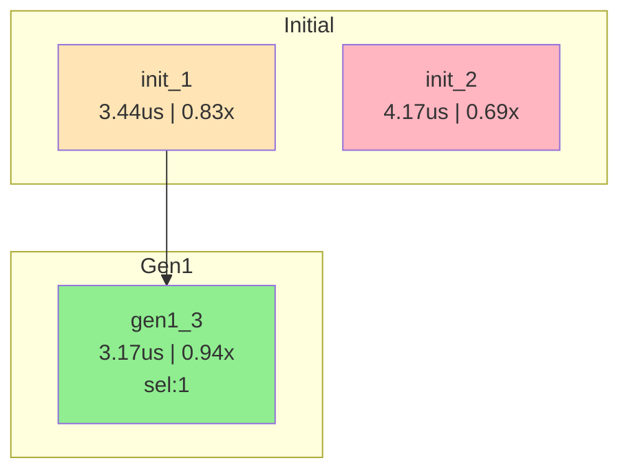

# AIKG Adaptive Search

## 1. Overview

The Adaptive Search module is an asynchronous pipeline search framework based on **UCB (Upper Confidence Bound)** selection strategy, designed to replace the original island/elite evolutionary algorithm.

### 1.1 Key Features

| Feature | evolve (Island/Elite) | adaptive_search |
|---------|----------------------|-----------------|
| Execution Mode | Synchronous rounds (wait for all tasks) | **Asynchronous pipeline** (refill on completion) |
| Parent Selection | Elite pool + random | **UCB selection** (performance + exploration balance) |
| Failure Handling | Keep information | **Discard** (only keep successful tasks) |

### 1.2 Design Goals

1. **Improve Resource Utilization**: Asynchronous pipeline, no waiting waste
2. **Intelligent Parent Selection**: UCB strategy balances exploration and exploitation
3. **Simplified Logic**: Only store successful tasks, discard failures
4. **Continuous Exploration**: Generate initial tasks when DB is empty

---

## 2. Architecture

### 2.1 Core Components

```
┌─────────────────────────────────────────────────────────────────┐
│                      Controller (搜索控制器)                      │
└─────────────────────────────────────────────────────────────────┘
        │                    │                    │
        ▼                    ▼                    ▼
┌───────────────┐   ┌───────────────┐   ┌───────────────┐
│   Task Pool   │   │ Waiting Queue │   │   Success DB  │
│ (Running)     │   │ (Pending)     │   │ (Successful)  │
│  max=concur   │   │  FIFO Queue   │   │  UCB Stats    │
└───────────────┘   └───────────────┘   └───────────────┘
        │                    ▲                    │
        │                    │                    │
        ▼                    │                    ▼
┌───────────────┐            │           ┌───────────────┐
│ Task Complete │────────────┘           │ UCB Selector  │
│ + Profiling   │                        │ (perf+count)  │
└───────────────┘                        └───────────────┘
        │                                        │
        ▼                                        ▼
   Success → Add to DB                  ┌───────────────┐
   Failure → Discard                    │ Task Generator │
                                        │ - Tiered insp  │
                                        │ - meta_prompts │
                                        │ - handwrite    │
                                        └───────────────┘
```

### 2.2 File Structure

```
ai_kernel_generator/core/adaptive_search/
├── __init__.py           # Module exports
├── success_db.py         # SuccessDB, SuccessRecord - Success task database
├── task_pool.py          # AsyncTaskPool, PendingTask, TaskResult - Async task pool
├── ucb_selector.py       # UCBParentSelector - UCB parent selector
├── task_generator.py     # TaskGenerator - Task generator (reuses existing components)
├── controller.py         # AdaptiveSearchController - Search controller
└── adaptive_search.py    # Main entry function
```

---

## 3. UCB Selection Strategy

### 3.1 UCB Formula

$$UCB(s) = Q(s) + c \cdot \sqrt{\frac{\ln (N_{total}+1)}{N(s) + 1}}$$

Where:
- **Q(s)**: Quality score based on **rank** (Rank-based)
- **N(s)**: Number of times this node has been selected
- **N_total**: Global total selection count
- **c**: Exploration coefficient (default √2 ≈ 1.414)

### 3.2 Quality Score Calculation (Rank-based)

$$Q(s) = \frac{n - rank}{n - 1}$$

Where:
- **n**: Total number of records in DB
- **rank**: Task's rank by gen_time ascending (1 = best)

**Advantages of Rank-based**:
- **Scale-invariant**: Q values are fixed in [0, 1], independent of operator performance scale
- **Clear differentiation**: rank=1 → Q=1.0, rank=n → Q=0.0
- **Cross-operator consistency**: Same selection behavior for ReLU (3us) and Matmul (300us)

### 3.3 Exploration Term Calculation

$$E(s) = c \cdot \sqrt{\frac{\ln (N_{total}+1)}{N(s) + 1}}$$

- Uses `N(s)+1` as denominator to avoid division by zero
- Unselected tasks (N(s)=0) get a larger but **finite** exploration value
- Does NOT unconditionally prioritize unselected tasks

### 3.4 Selection Example

```
Records in DB (n=4):
┌────────────────────────────────────────────────────────────────┐
│ ID     │ gen_time │ rank │ Q(s)  │ count │ E     │ UCB   │
├────────────────────────────────────────────────────────────────┤
│ task_1 │ 0.5ms    │  1   │ 1.00  │   5   │ 0.60  │ 1.60  │ ← Best performance
│ task_4 │ 0.6ms    │  2   │ 0.67  │   3   │ 0.73  │ 1.40  │
│ task_2 │ 0.8ms    │  3   │ 0.33  │   1   │ 0.95  │ 1.28  │
│ task_3 │ 1.2ms    │  4   │ 0.00  │   0   │ 1.34  │ 1.34  │ ← Never selected
└────────────────────────────────────────────────────────────────┘
Result: task_1 has highest UCB (1.60), selected
```

---

## 4. Main Loop Flow

```
┌─────────────────────────────────────────────────────────────────┐
│                       Initialization Phase                       │
│  1. Generate initial_task_count initial tasks (no inspiration)   │
│  2. Fill task pool (remaining go to waiting queue)               │
└─────────────────────────────────────────────────────────────────┘
                              ↓
┌─────────────────────────────────────────────────────────────────┐
│                          Main Loop                               │
│                                                                  │
│  1. Wait for any task to complete                                │
│                                                                  │
│  2. Process completed tasks                                      │
│     - Success → Add to Success DB                                │
│     - Failure → Discard                                          │
│                                                                  │
│  3. Refill task pool                                             │
│     a) If waiting queue has tasks → Take and submit              │
│     b) If DB not empty → UCB select parent → Tiered sampling →   │
│                          Generate evolved tasks                   │
│     c) If DB empty → Generate initial tasks (continue exploring) │
│                                                                  │
│  4. Check stop condition: max_total_tasks reached                │
└─────────────────────────────────────────────────────────────────┘
                              ↓
┌─────────────────────────────────────────────────────────────────┐
│                        Collect Results                           │
│  Return best implementations, statistics, etc.                   │
└─────────────────────────────────────────────────────────────────┘
```

---

## 5. Inspiration Sampling Strategy

For evolved tasks, select **parent + tiered sampling inspirations**:

```
┌─────────────────────────────────────────────────────────────────┐
│                      UCB Select Parent                           │
│                             │                                    │
│                             ▼                                    │
│                     ┌───────────────┐                           │
│                     │    Parent     │  (is_parent=True)          │
│                     │  UCB Selected │                            │
│                     └───────────────┘                           │
│                             +                                    │
├─────────────────────────────────────────────────────────────────┤
│ Other successful impls in DB (sorted by gen_time, exclude parent)│
├─────────────────────────────────────────────────────────────────┤
│  ┌──────────────┐  ┌──────────────┐  ┌──────────────┐          │
│  │   GOOD       │  │   MEDIUM     │  │   POOR       │          │
│  │   Top 30%    │  │   Mid 40%    │  │   Bottom 30% │          │
│  │  Pick 1 best │  │  Pick 1 best │  │  Pick 1 best │          │
│  └──────────────┘  └──────────────┘  └──────────────┘          │
│         ↓                ↓                ↓                     │
│  Final inspirations = [parent] + [good, medium, poor]           │
└─────────────────────────────────────────────────────────────────┘
```

---

## 6. Configuration Parameters

### 6.1 Concurrency Control

| Parameter | Type | Default | Description |
|-----------|------|---------|-------------|
| `max_concurrent` | int | 8 | Maximum concurrent tasks in pool |
| `initial_task_count` | int | 8 | Number of initial tasks to generate |
| `tasks_per_parent` | int | 1 | Tasks to generate per parent selection |

### 6.2 UCB Selection Parameters

| Parameter | Type | Default | Description |
|-----------|------|---------|-------------|
| `exploration_coef` | float | 1.414 | UCB exploration coefficient c |
| `random_factor` | float | 0.1 | Random perturbation during selection |
| `use_softmax` | bool | False | Use softmax sampling instead of argmax |

### 6.3 Stop Condition

| Parameter | Type | Default | Description |
|-----------|------|---------|-------------|
| `max_total_tasks` | int | 100 | Maximum total tasks (only stop condition) |

**Stop Condition Behavior**:
- When `max_total_tasks` is reached, wait for all running tasks to complete, then return results.

### 6.4 Inspiration Sampling Parameters

| Parameter | Type | Default | Description |
|-----------|------|---------|-------------|
| `inspiration_sample_num` | int | 3 | Inspiration sample count (excluding parent) |
| `handwrite_sample_num` | int | 2 | Handwrite suggestion sample count |
| `handwrite_decay_rate` | float | 2.0 | Handwrite suggestion decay rate |

---

## 7. Usage Examples

### 7.1 Basic Usage

```python
from ai_kernel_generator.core.worker.manager import register_worker
from ai_kernel_generator.core.adaptive_search import adaptive_search

# 1. Register Worker
await register_worker(backend='cuda', arch='a100', device_ids=[0, 1])

# 2. Run adaptive search
result = await adaptive_search(
    op_name="my_kernel",
    task_desc=task_code,
    dsl="triton_cuda",
    framework="torch",
    backend="cuda",
    arch="a100",
    config=config,
    
    # Concurrency control
    max_concurrent=4,
    initial_task_count=4,
    
    # UCB parameters
    exploration_coef=1.414,
    random_factor=0.1,
    
    # Stop condition
    max_total_tasks=50
)

# 3. Get best implementations
for impl in result['best_implementations']:
    print(f"gen_time: {impl['gen_time']:.4f}ms, speedup: {impl['speedup']:.2f}x")
```

### 7.2 Using Command Line Tool

Run via `run_single_adaptive_search.py` script:

```bash
# Use default config
python aikg/tools/run_single_adaptive_search.py

# Use specified config file
python aikg/tools/run_single_adaptive_search.py config/adaptive_search_config.yaml
```

Config file example (`adaptive_search_config.yaml`):

```yaml
# Task config
task:
  op_name: "aikg_relu"
  task_desc: "path/to/task.py"  # Task description file path

# Environment config
environment:
  dsl: "triton_ascend"
  framework: "torch"
  backend: "ascend"
  arch: "ascend910b4"
  device_list: [0, 1]

# Concurrency config
concurrency:
  max_concurrent: 4
  initial_task_count: 4
  tasks_per_parent: 1

# Stop condition
stopping:
  max_total_tasks: 50

# UCB selection parameters
ucb_selection:
  exploration_coef: 1.414
  random_factor: 0.1

# LLM config file path (required)
config_path: "python/ai_kernel_generator/config/vllm_triton_ascend_evolve_config.yaml"
```

---

## 8. Output Results

### 8.1 Result Dictionary

The result dictionary returned after search completion contains:

| Field | Type | Description |
|-------|------|-------------|
| `op_name` | str | Operator name |
| `total_submitted` | int | Total tasks submitted |
| `total_success` | int | Successful tasks |
| `total_failed` | int | Failed tasks |
| `success_rate` | float | Success rate |
| `elapsed_time` | float | Total elapsed time (seconds) |
| `stop_reason` | str | Reason for stopping |
| `best_implementations` | list | Best implementations (sorted by gen_time) |
| `storage_dir` | str | Storage directory |
| `log_dir` | str | Log directory |
| `lineage_graph` | str | Lineage graph file path |

### 8.2 Lineage Graph

After search completion, a task lineage graph (Mermaid format) is automatically generated and saved to the Log directory:

```
{log_dir}/{op_name}_lineage_graph.md
```

The lineage graph includes:
- **Flowchart**: Shows parent-child relationships, layered by generation
- **Color coding**: 🟢 Green=good performance, 🟡 Orange=medium, 🔴 Red=poor performance
- **Task details table**: Contains gen_time, speedup, parent, selection count, etc.

Example:

