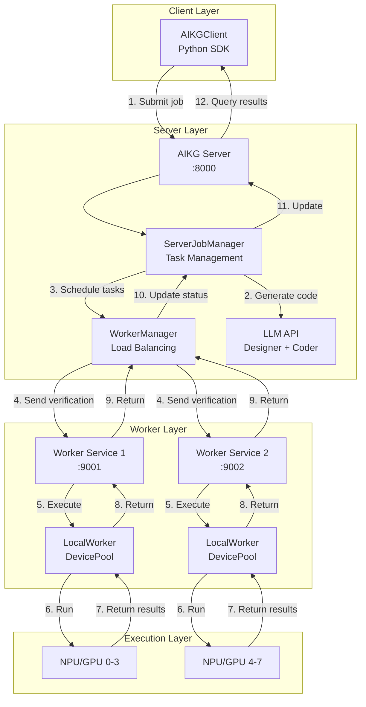
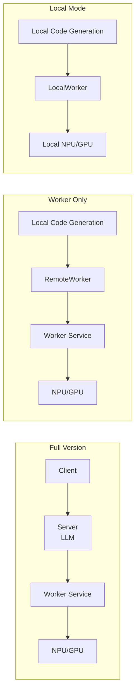

# AIKG Service Architecture

## Overview

AIKG service architecture separates code generation from execution verification, supporting distributed deployment and unified resource management.

### Core Design Principles

1. **Separation of Concerns**: Server handles code generation, Worker handles execution verification
2. **Unified Interface**: Supports LocalWorker and RemoteWorker through `WorkerInterface` abstraction
3. **Load Balancing**: WorkerManager automatically selects the best Worker
4. **Flexible Deployment**: Supports single-machine, distributed, and hybrid deployment modes

## Architecture Diagram

### Overall Architecture



## Core Components

### 1. AIKG Server
- **Responsibilities**: Receive tasks, code generation, task scheduling
- **Port**: 8000
- **Features**:
  - Receive jobs submitted by Client
  - Call LLM to generate code (Designer + Coder)
  - Schedule Workers via WorkerManager for execution verification
  - Manage job lifecycle

### 2. Worker Service
- **Responsibilities**: Device management, execute verification and performance analysis
- **Port**: 9001
- **Features**:
  - Manage local NPU/GPU device pool (DevicePool)
  - Provide device acquisition/release API (`acquire_device`/`release_device`)
  - Receive verification tasks (TAR packages) from Server or RemoteWorker
  - Execute verification on local NPU/GPU
  - Return execution results

### 3. WorkerManager
- **Responsibilities**: Worker registration, discovery, load balancing
- **Features**:
  - Manage multiple Worker instances
  - Select best Worker based on backend/arch
  - Load balancing (based on capacity/load)
- **Convenience Functions**:
  - `register_local_worker()`: One-line registration of LocalWorker
  - `register_remote_worker()`: One-line registration of RemoteWorker with automatic capacity query

## Usage Comparison

| Feature | Full Version | Worker Only | Local Mode |
|---------|--------------|-------------|------------|
| **Code Generation** | Server (LLM) | Local | Local |
| **Execution Verification** | Worker Service | Worker Service | LocalWorker |
| **Deployment Complexity** | High | Medium | Low |
| **Use Cases** | Production | Existing code generation | Development/Testing |
| **Network Required** | Yes | Yes | No |
| **Scalability** | High (Multi-Worker) | Medium | Low |

### Architecture Comparison



## Usage

### Mode 1: Full Version (Client-Server-Worker)

Suitable for production environments, supports distributed deployment.

#### Architecture
```
Client → Server (NPU/GPU Server:8000) → Worker Service (NPU/GPU Server:9001) → NPU/GPU
```

#### Deployment Steps

**1. Start Worker Service (NPU/GPU Server)**
```bash
cd /path/to/aikg/aikg
source env.sh
./scripts/server_related/start_worker_service.sh
```

**2. Start AIKG Server (NPU/GPU Server)**
```bash
cd /path/to/aikg/aikg
source env.sh
./scripts/server_related/start_server.sh
```

**3. Register Worker to Server**
```bash
# Ascend backend
./scripts/server_related/register_worker_to_server.sh \
    http://localhost:8000 \
    http://localhost:9001 \
    ascend ascend910b4 1

# CUDA backend
./scripts/server_related/register_worker_to_server.sh \
    http://localhost:8000 \
    http://localhost:9001 \
    cuda a100 1
```

**4. Client Submit Tasks**
```python
from ai_kernel_generator.client.aikg_client import AIKGClient

client = AIKGClient("http://localhost:8000")  # Via SSH tunnel

# Submit single job (Ascend)
job_id = client.submit_job(
    op_name="relu",
    task_desc="...",
    job_type="single",
    backend="ascend",
    arch="ascend910b4",
    dsl="triton_ascend",
    framework="torch",
    workflow="coder_only_workflow"
)

# Submit single job (CUDA)
job_id = client.submit_job(
    op_name="relu",
    task_desc="...",
    job_type="single",
    backend="cuda",
    arch="a100",
    dsl="triton_cuda",
    framework="torch",
    workflow="coder_only_workflow"
)

# Wait for completion
status = client.wait_for_completion(job_id, timeout=1800)
print(f"Job status: {status['status']}")
print(f"Result: {status.get('result')}")

# Submit evolve job
job_id = client.submit_job(
    op_name="relu",
    task_desc="...",
    job_type="evolve",
    backend="ascend",  # or "cuda"
    arch="ascend910b4",  # or "a100"
    dsl="triton_ascend",  # or "triton_cuda"
    framework="torch",
    max_rounds=2,
    parallel_num=2
)

status = client.wait_for_completion(job_id, timeout=3600)
```

#### Features
- ✅ Code generation and execution separation
- ✅ Multi-Worker load balancing support
- ✅ Remote deployment support
- ✅ Unified task management

### Mode 2: Worker Only (RemoteWorker)

Suitable for existing code generation environments that only need remote execution verification.

#### Architecture
```
Local Code Generation 
  └─> RemoteWorker
      ├─> 1. acquire_device (HTTP) → Worker Service → DevicePool → returns device_id
      ├─> 2. Generate verification script with device_id
      ├─> 3. verify/profile (HTTP) → Worker Service → Execute script → NPU/GPU
      └─> 4. release_device (HTTP) → Worker Service → DevicePool
```

#### Usage Examples

**1. Start Worker Service (NPU/GPU Server)**
```bash
cd /path/to/aikg/aikg
source env.sh
./scripts/server_related/start_worker_service.sh
```

**2. Use RemoteWorker Locally**

**Method A: Use Convenience Function (Recommended)**
```python
from ai_kernel_generator.core.worker.manager import register_remote_worker
from ai_kernel_generator.core.task import Task

# Method 1: Read worker_url from environment variable, auto-query capacity
export AIKG_WORKER_URL=http://localhost:9001  # Via SSH tunnel
await register_remote_worker(backend="ascend", arch="ascend910b4")

# Method 2: Explicitly specify worker_url
await register_remote_worker(
    backend="ascend",
    arch="ascend910b4",
    worker_url="http://localhost:9001"
)

# Or CUDA backend
await register_remote_worker(
    backend="cuda",
    arch="a100",
    worker_url="http://localhost:9001"
)
```

**Method B: Manual Registration (Advanced)**
```python
from ai_kernel_generator.core.worker.remote_worker import RemoteWorker
from ai_kernel_generator.core.worker.manager import get_worker_manager

worker_manager = get_worker_manager()
remote_worker = RemoteWorker("http://localhost:9001")
await worker_manager.register(
    remote_worker,
    backend="ascend",
    arch="ascend910b4",
    capacity=1  # If not specified, will auto-query from remote worker
)

# Create Task (without device_pool)
task = Task(
    op_name="relu",
    task_desc="...",
    task_id="test_task_001",
    dsl="triton_ascend",  # or "triton_cuda"
    backend="ascend",     # or "cuda"
    arch="ascend910b4",   # or "a100"
    config=config,
    framework="torch",
    workflow="coder_only_workflow"
    # Without device_pool, Task will get RemoteWorker from WorkerManager
)

# Run task
await task.run()
```

**3. Use RemoteWorker in Evolve Flow**
```bash
# Method 1: Use environment variable (recommended)
export AIKG_WORKER_URL=http://localhost:9001
python examples/run_torch_evolve_triton.py --worker remote

# Method 2: Use command line argument
python examples/run_torch_evolve_triton.py --worker remote --worker-url http://localhost:9001
```

#### Features
- ✅ Local code generation, remote execution
- ✅ No Server deployment required
- ✅ Suitable for existing code generation workflows
- ✅ Supports Evolve flow

### Mode 3: Local Mode (LocalWorker)

Suitable for single-machine environments where all components run locally.

#### Architecture
```
Local Code Generation → LocalWorker → Local NPU/GPU
```

#### Usage Examples

**Method A: Use Convenience Function (Recommended)**
```python
from ai_kernel_generator.core.worker.manager import register_local_worker
from ai_kernel_generator.core.task import Task

# Register LocalWorker
await register_local_worker([0], backend="ascend", arch="ascend910b4")  # Single device
# or await register_local_worker([0, 1, 2, 3], backend="ascend", arch="ascend910b4")  # Multi-device

# Create Task (without device_pool, get from WorkerManager)
task = Task(
    op_name="relu",
    task_desc="...",
    task_id="test_task_001",
    dsl="triton_ascend",  # or "triton_cuda"
    backend="ascend",     # or "cuda"
    arch="ascend910b4",   # or "a100"
    config=config,
    framework="torch",
    workflow="coder_only_workflow"
    # Without device_pool, Task will get LocalWorker from WorkerManager
)

# Run task
await task.run()
```

**Method B: Use device_pool (Deprecated, Backward Compatible)**

⚠️ **Note**: Passing `device_pool` directly to `Task()` is the old approach and will be removed in future versions. Please use Method A (convenience function).

```python
from ai_kernel_generator.core.async_pool.device_pool import DevicePool
from ai_kernel_generator.core.task import Task

# Create device_pool
device_pool = DevicePool([0])

# Create Task (with device_pool, auto-register as LocalWorker)
# ⚠️ This method is deprecated and will trigger DeprecationWarning
task = Task(
    op_name="relu",
    task_desc="...",
    task_id="test_task_001",
    dsl="triton_ascend",
    backend="ascend",
    arch="ascend910b4",
    config=config,
    device_pool=device_pool,  # Pass device_pool (deprecated)
    framework="torch"
)

# Run task
await task.run()
```

**Recommended Migration to Method A**:
```python
# 1. Register LocalWorker to WorkerManager (one line)
from ai_kernel_generator.core.worker.manager import register_local_worker
await register_local_worker([0], backend="ascend", arch="ascend910b4")

# 2. Create Task without device_pool
task = Task(
    op_name="relu",
    task_desc="...",
    task_id="test_task_001",
    dsl="triton_ascend",
    backend="ascend",
    arch="ascend910b4",
    config=config,
    framework="torch",
    workflow="coder_only_workflow"
    # Without device_pool, Task will get LocalWorker from WorkerManager
)
```

#### Features
- ✅ Simple and direct
- ✅ No network required
- ✅ Suitable for single-machine development and testing

## Quick Start

### Full Version Test

**Deployment Steps**:
1. Start Worker Service and AIKG Server on NPU/GPU server
2. Register Worker to Server
3. Submit tasks via AIKGClient on Client side

**Example**:
```python
from ai_kernel_generator.client.aikg_client import AIKGClient

client = AIKGClient("http://localhost:8000")
job_id = client.submit_job(
    op_name="relu",
    task_desc="...",
    job_type="single",
    backend="ascend",  # or "cuda"
    arch="ascend910b4",  # or "a100"
    dsl="triton_ascend",  # or "triton_cuda"
    framework="torch"
)
status = client.wait_for_completion(job_id)
```

### Worker Only Test

**Deployment Steps**:
1. Start Worker Service on NPU/GPU server
2. Register RemoteWorker to WorkerManager locally
3. Use Task or Evolve flow without device_pool

**Example**:
```python
# Register RemoteWorker (using convenience function)
from ai_kernel_generator.core.worker.manager import register_remote_worker
from ai_kernel_generator.core.task import Task

# Read worker_url from environment variable, auto-query capacity
export AIKG_WORKER_URL=http://localhost:9001
await register_remote_worker(backend="ascend", arch="ascend910b4")

# Use Task (without device_pool)
task = Task(op_name="relu", ..., workflow="coder_only_workflow")
await task.run()
```

### Evolve Flow

```bash
# Local mode
python examples/run_torch_evolve_triton.py --worker local

# Remote mode
export AIKG_WORKER_URL=http://localhost:9001
python examples/run_torch_evolve_triton.py --worker remote
```

## API Interfaces

### Server API

- `POST /api/v1/jobs/submit` - Submit job
- `GET /api/v1/jobs/{job_id}/status` - Query job status
- `POST /api/v1/workers/register` - Register Worker
- `GET /api/v1/workers/status` - Query Worker status

### Worker Service API

**Device Management API**:
- `POST /api/v1/acquire_device` - Acquire available device (returns device_id)
- `POST /api/v1/release_device` - Release device

**Task Execution API**:
- `POST /api/v1/verify` - Execute verification task
- `POST /api/v1/profile` - Execute performance analysis

**Status Query API**:
- `GET /api/v1/status` - Query Worker status (includes backend, arch, devices info)

**Note**: RemoteWorker first calls `acquire_device` to get a device_id, uses that ID to generate verification scripts, then calls `verify`/`profile` to execute tasks, and finally calls `release_device` to release the device. This ensures that `CUDA_VISIBLE_DEVICES`/`DEVICE_ID` in the script matches the actual device being used.

## Configuration

### Worker Service Environment Variables

```bash
# Ascend backend
export WORKER_BACKEND=ascend
export WORKER_ARCH=ascend910b4
export WORKER_DEVICES=0,1,2,3
export WORKER_PORT=9001

# CUDA backend
export WORKER_BACKEND=cuda
export WORKER_ARCH=a100
export WORKER_DEVICES=0,1,2,3
export WORKER_PORT=9001
```

### Client Environment Variables

```bash
# Remote Worker URL (for register_remote_worker convenience function)
export AIKG_WORKER_URL=http://localhost:9001
# Or via SSH tunnel
export AIKG_WORKER_URL=http://localhost:9001  # Local port mapped to remote 9001
```

### Server Configuration

Server runs on `0.0.0.0:8000` by default, can be adjusted via `uvicorn` parameters.

## Notes

1. **Network Connection**: Remote mode requires stable network connection
2. **SSH Tunnel**: When accessing via jump server, SSH tunnel needs to be established
3. **Resource Management**: 
   - **WorkerManager**: Manages Worker instances, load balancing (based on load/capacity)
   - **DevicePool**: Manages device mutex (one DevicePool per Worker)
   - **Device Acquisition Flow**: 
     - LocalWorker: Directly acquires from local DevicePool
     - RemoteWorker: Acquires via HTTP from remote Worker Service's DevicePool
4. **Environment Check**: Remote mode automatically skips hardware checks (triton, nvidia-smi, npu-smi)
5. **Backend Support**: Supports Ascend (triton_ascend) and CUDA (triton_cuda) backends
6. **Automatic Capacity Query**: `register_remote_worker` automatically queries actual device count from remote worker's `/api/v1/status` interface, no manual specification needed. If query fails, defaults to 1
7. **Environment Variable**: Use `AIKG_WORKER_URL` environment variable to specify remote worker URL, simplifying configuration

