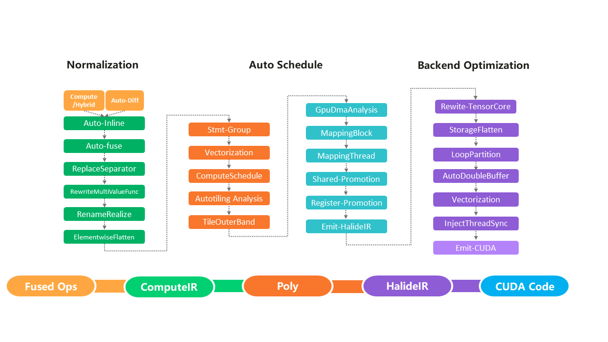

- [AKG简述](#AKG简述)
- [硬件后端支持](#硬件后端支持)
- [构建](#构建)
    - [从MindSpore侧构建](#从MindSpore侧构建)
    - [独立构建](#独立构建)
- [运行](#运行)
- [贡献](#贡献)
- [版本说明](#版本说明)
- [许可证](#许可证)

[View English](./README.md)

## AKG简述
AKG(Auto Kernel Generator)对深度神经网络中的算子进行优化，并提供特定模式下的算子自动融合功能。AKG与MindSpore的图算融合功能协同工作，可提升在不同硬件后端上运行网络的性能。

AKG由三个基本的优化模块组成：规范化、自动调度和后端优化。
- **规范化：** 为了解决polyhedral表达能力的局限性（只能处理静态的线性程序），需要首先对计算公式IR进行规范化。规范化模块中的优化主要包括自动运算符inline、自动循环融合和公共子表达式优化等。
- **自动调度：** 自动调度模块基于polyhedral技术，主要包括自动向量化、自动切分、thread/block映射、依赖分析和数据搬移等。
- **后端优化：** 后端优化模块的优化主要包括TensorCore使能、双缓冲区、内存展开和同步指令插入等。

  

## 硬件后端支持
当前支持`Ascend910`、`NVIDIA V100/A100`和`CPU`等，更多硬件后端支持待开发。

## 构建

### 从MindSpore侧构建
详细细节请参考[MindSpore README.md](https://gitee.com/mindspore/mindspore/blob/master/README.md)。

### 独立构建
我们建议您从MindSpore侧构建运行AKG代码，但同时为了方便开发，我们提供了独立编译运行AKG的方式。
详细的编译依赖请参考[MindSpore安装指南](https://www.mindspore.cn/install)。
- 构建Ascend910版本

  在下载代码前需安装[git-lfs软件](https://github.com/git-lfs/git-lfs/wiki/installation)。
  ```
  git clone https://gitee.com/mindspore/akg.git
  cd akg
  bash build.sh -e ascend -j8
  ```

- 构建GPU版本
  ```
  git clone https://gitee.com/mindspore/akg.git
  cd akg
  bash build.sh -e gpu -j8
  ```

- 构建CPU版本
  ```
  git clone https://gitee.com/mindspore/akg.git
  cd akg
  bash build.sh -e cpu -j8
  ```

## 运行
1. 设置环境变量

- Ascend910
  ```
  cd tests
  source ./test_env.sh
  ```

- NVIDIA V100/A100
  ```
  cd tests
  source ./test_env.sh gpu
  ```

- CPU
  ```
  cd tests
  source ./test_env.sh cpu
  ```

2. 运行测试用例
- 使用测试脚本：
```
cd tests/st
python run.py -e gpu -o add -l level0  # 执行GPU Add算子的level0用例
```
  使用说明可以`python run.py -h`查看．
- 使用测试文件：
  
  - Ascend910
  ```
  cd tests/st/ops/
  pytest -s test_abs.py -m "level0 and platform_x86_ascend_training" # 运行Ascend level0测试用例
  ```

  - NVIDIA V100/A100
  ```
  cd tests/st/ops/
  pytest -s test_abs.py -m "level0 and platform_x86_gpu_training" # 运行GPU level0测试用例
  ```

  - CPU
  ```
  cd tests/st/ops/
  pytest -s test_abs.py -m "level0 and platform_x86_cpu" # 运行CPU level0测试用例
  ```

## 使用AKG生成高性能算子
见[Wiki](https://gitee.com/mindspore/akg/wikis)。

## AKG-MLIR

AKG-MLIR是基于MLIR（Multi-Level Intermediate Representation）开发的新一代AKG，GPU和CPU后端下部分场景性能超越AKG，同时增加了对于动态形状表达和计算的支持。

### 构建

基于上述AKG构建方式，增加选项`-r`编译akg-mlir部分，以CPU为例：

```shell
bash build.sh -e cpu -j8 -r

Usage:
bash build.sh [-e cpu|gpu|ascend|all] [-j[n]] [-t on|off] [-o] [-u] [-m akg-mlir-only|all] [-s] [-c] [-h]

Options:
    -h Print usage
    -d Debug mode
    -e Hardware environment: cpu, gpu, ascend or all
    -j[n] Set the threads when building (Default: -j8)
    -t Unit test: on or off (Default: off)
    -o Output .o file directory
    -u Enable auto tune
    -m Compile mode: akg-mlir-only or all, default: all
    -s Specifies the source path of third-party, default: none \n\t[0]llvm-project\n\t[1]symengine
    -c Clean built files, default: off
    -r Enable akg-mlir, default: off
```

由于AKG-MLIR基于MLIR/LLVM框架搭建，构建所需依赖项请参考[LLVM安装说明](https://llvm.org/docs/GettingStarted.html#getting-the-source-code-and-building-llvm)提前安装。

### 运行

- 运行一个CPU融合算子的st用例，并显示运行10次后的平均执行时间：

```shell
cd ${AKG_ROOT_PATH}/akg-mlir/test
source test_env.sh
cd ${AKG_ROOT_PATH}/akg-mlir/python/akg_v2/exec_tools
python py_benchmark.py -e cpu -f ${AKG_ROOT_PATH}/akg-mlir/test/st/cpu/user_cases/Fused_Reshape_Mul_Sub_Mul_split_1885787488857948654.info -tr=10
```

- 运行一个包含多个mindspore.broadcast_to算子函数的ut用例，并显示将它们lower到Linalg Dialect的结果：

```shell
cd ${AKG_ROOT_PATH}/akg-mlir/test/ut/Dialect/MindSpore
export AKG_MLIR_TOOLS=${AKG_ROOT_PATH}/build/akg-mlir/bin
${AKG_MLIR_TOOLS}/akg-opt mindspore_broadcast_to_op.mlir -convert-mindspore-to-linalg
```

## 贡献

欢迎您的贡献，具体细节请参考[MindSpore贡献者Wiki](https://gitee.com/mindspore/mindspore/blob/master/CONTRIBUTING.md)。

## 版本说明

版本说明详见[RELEASE](RELEASE.md)。

## 许可证

[Apache License 2.0](LICENSE)。