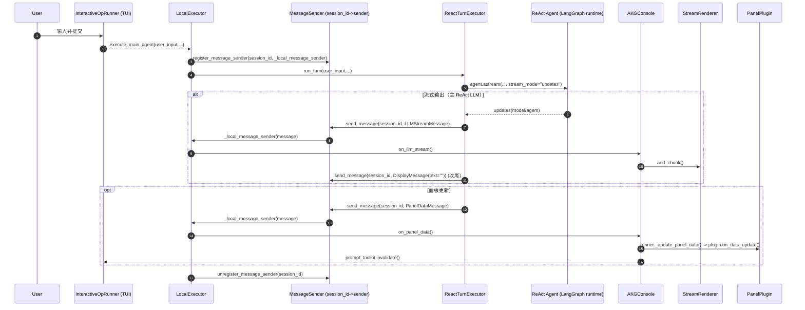

# AKG CLI 二次开发指南（ReAct 版）：主 Agent / 子 Agent 与 CLI（TUI/Console）交互机制

本文面向 **二次开发者**，解释 AKG 本地交互式 CLI/TUI 的关键链路：**消息发送**、**扩展消息类型**、**自定义面板（Panel Plugin）**。

> 范围说明：本文聚焦 **本地执行链路**（`LocalExecutor` 驱动），当前 CLI **仅使用 ReAct 主代理**，不再介绍旧版 MainOpAgent（start/continue）链路。

---

## 目录

- [1. 架构概览](#1-架构概览)
- [2. 组件与职责边界](#2-组件与职责边界)
- [3. MainOpAgent 与子 Agent：客户端视角的调用关系](#3-mainopagent-与子-agent客户端视角的调用关系)
- [4. 消息如何到达 UI：端到端链路](#4-消息如何到达-ui端到端链路)
- [5. 开发者手册：如何给客户端发送消息](#5-开发者手册如何给客户端发送消息)
- [6. 扩展指南：如何新增一种消息类型](#6-扩展指南如何新增一种消息类型)
- [7. 扩展指南：如何实现/替换自定义面板（Panel Plugin）](#7-扩展指南如何实现替换自定义面板panel-plugin)
- [8. 常见坑与边界条件（FAQ）](#8-常见坑与边界条件faq)

---

## 1. 架构概览

本地交互式链路的核心是：**CLI/TUI 只与 ReAct 主代理交互**；子 Agent（`codeonly/evolve/adaptive_search/kernel_verifier`）通过 **tools** 被 ReAct 调度执行。

典型数据流（概念级）：

- **用户输入** → `InteractiveOpRunner`（TUI）→ `LocalExecutor.execute_main_agent()`
- **ReAct 主代理（LangGraph runtime）** 驱动对话与 tools / 子 Agent 调度
- **消息输出**（流式/文本/面板）→ `MessageSender`（按 `session_id` 路由）→ `AKGConsole`（Console 输出 + TUI 刷新）

---

## 2. 组件与职责边界

建议先把“谁负责什么”想清楚，再动扩展点。

### 2.1 关键组件列表

- **Client / TUI**
  - `akg_agents/python/akg_agents/cli/commands/op/runners.py`
    - `InteractiveOpRunner`：Prompt-toolkit TUI 主循环、输入处理、`F2` 切换面板显示
  - `akg_agents/python/akg_agents/cli/console.py`
    - `AKGConsole`：统一输出入口（文本 Panel、LLM 流式渲染、面板数据转交 runner）

- **Runtime**
  - `akg_agents/python/akg_agents/cli/runtime/local_executor.py`
    - `LocalExecutor`：会话级状态管理；注入 `session_id`；注册/注销 session sender；把消息路由给 Console；驱动 ReAct 每轮执行
  - `akg_agents/python/akg_agents/cli/runtime/react_executor.py`
    - `ReactTurnExecutor`：调用 `agent.astream(..., stream_mode="updates")` 并把事件映射为 CLI 消息（`LLMStreamMessage/PanelDataMessage/DisplayMessage`）

- **Message Bus（会话路由层）**
  - `akg_agents/python/akg_agents/cli/runtime/message_sender.py`
    - `_session_senders`：`session_id -> sender(message)` 的线程安全映射
    - `register_message_sender()/unregister_message_sender()/send_message()`

- **统一消息协议（事件类型）**
  - `akg_agents/python/akg_agents/cli/messages.py`
    - `Message` 抽象基类 + `to_dict()`（为网络传输/落盘回放保留）
    - 内置：`DisplayMessage`、`LLMStreamMessage`、`FinalResultMessage`、`ErrorMessage`、`PanelDataMessage`
    - `MESSAGE_REGISTRY` + `pack_message()/unpack_message()`（扩展入口）

- **Agent**
  - `akg_agents/python/akg_agents/core/agent/agent_base_v2.py`
    - `AgentBaseV2`：通过 `langchain.agents.create_agent(...)` 构建 ReAct agent（LangGraph runtime）
  - `akg_agents/python/akg_agents/core/agent/react_agent.py`
    - `MainOpAgent`（ReAct）：提供 system prompt、tools 列表、middleware（如 trim messages）
  - `akg_agents/python/akg_agents/core/agent/agent_base.py`
    - 子 Agent（如 codeonly）内部仍可能通过 `AgentBase.run_llm()` 发送 `LLMStreamMessage`（见下文“流式与并发策略”）

- **子 Agent 注册中心**
  - `akg_agents/python/akg_agents/core/sub_agent_registry.py`
    - `get_registry()` 返回全局 `SubAgentRegistry`
    - `SubAgentRegistry.get_agent(...)` 创建子 Agent 实例（MainOpAgent 内部调用）

- **Panel 插件**
  - `akg_agents/python/akg_agents/cli/ui/panel_plugin.py`：`PanelPlugin` 接口
  - `akg_agents/python/akg_agents/cli/ui/plugin_registry.py`：`register_plugin()/get_default_plugin()`
    - 默认插件名固定为 `"kernel_impl_list"`
  - `akg_agents/python/akg_agents/cli/ui/plugins/kernel_impl_list.py`
    - `KernelImplListPlugin`：默认实现，支持 `update_current/move_to_history/reset`

---

## 3. ReAct 主代理与子 Agent：客户端视角的调用关系

客户端无需直接感知子 Agent；你可以把 MainOpAgent 看成“唯一入口”。

### 3.1 ReAct 的执行方式（事件流）

ReAct 主代理由 `langchain.agents.create_agent(...)` 构建，CLI 侧通过：

- `agent.astream(..., stream_mode="updates")`

获得事件流（model 输出、tool 输出、`__interrupt__` 等），并由 `ReactTurnExecutor` 将事件映射为 CLI 消息。

### 3.2 子 Agent 的选择与执行（tools）

ReAct 通过 tools 调用子 Agent：

- `call_op_task_builder`
- `call_codeonly`
- `call_evolve`
- `call_adaptive_search`
- `call_kernel_verifier`

tools 的封装位于：

- `akg_agents/python/akg_agents/core/tools/sub_agent_tool.py`

### 3.3 子 Agent 返回结构（典型字段）

不同子 Agent 返回结构略有差异，但 MainOpAgent 会从结果里抽取并对外更新状态，常见字段包括：

- `generated_code`：生成的 DSL 代码（如 Triton）
- `verification_result` / `verification_error`：验证结果
- `profile_result`：性能测试结果（如 `gen_time/base_time/speedup`）
- `storage_dir/log_dir/task_folder/sub_agent_type`：用于保存与展示的元数据（evolve/adaptive_search 特别常见）

---

## 4. 消息如何到达 UI：端到端链路

本地模式的核心原则：**所有消息都必须带 `session_id`，由 MessageSender 按会话路由到 UI**。

### 4.1 时序图：一次对话轮次中的消息流（ReAct）



### 4.2 流式与并发策略（重要）

本仓库同时存在两种“流式来源”：

- **主 ReAct LLM 流式**：由 `ReactTurnExecutor` 从 `astream` 的 `AIMessage` 提取内容并发送 `LLMStreamMessage`
- **子 Agent 内部流式**：如 `call_op_task_builder` / `call_codeonly` 的实现内部仍可能通过 `AgentBase.run_llm()` 发送 `LLMStreamMessage`

为避免两路流式混到同一个 `StreamRenderer`，约定：

- 在 ReAct 侧检测到即将调用 `call_op_task_builder/call_codeonly` 时，先发送一次 `DisplayMessage(text="")` 结束当前主流式渲染
- 对可能并发/长流程的子 Agent（如 evolve/adaptive_search）强制关闭其内部 `LLMStreamMessage` 流式（避免乱序）

对应实现：

- `akg_agents/python/akg_agents/utils/stream_output.py`：ContextVar 级别的 stream 开关覆盖
- `akg_agents/python/akg_agents/core/tools/sub_agent_tool.py`：除 `codeonly` 外的子 Agent 强制关闭内部流式

### 4.3 ask_user：interrupt/resume（不抢 stdin）

`ask_user` 不使用 `input()`，而是使用 LangGraph `interrupt(message)` 触发 `__interrupt__` 事件并暂停图执行；下一轮用户输入会以 `Command(resume=...)` 恢复执行。

### 4.2 关键“为什么能到达 UI”

- `LocalExecutor.execute_main_agent()` 在本轮对话执行前：
  - 注册 `_local_message_sender` 到 `MessageSender`（以 `session_id` 为 key）
- Agent 侧通过 `send_message(session_id, message)`：
  - `MessageSender` 找到对应 sender 回调并调用
- 本地 sender 回调最终走到：
  - `LocalExecutor._route_to_console()` → `AKGConsole.on_*()` →（可选）TUI 刷新

---

## 5. 开发者手册：如何给客户端发送消息

本节按三类最常见消息说明“怎么用”和“注意点”。消息定义均在 `akg_agents/python/akg_agents/cli/messages.py`。

### 5.1 文本消息：DisplayMessage

- **用途**：非流式提示/结果/说明文本（最终会以 Rich 的 Panel 样式显示）
- **发送入口**：`akg_agents/python/akg_agents/cli/runtime/message_sender.py: send_message()`

示例（业务代码任意位置）：

```python
from akg_agents.cli.messages import DisplayMessage
from akg_agents.cli.runtime.message_sender import send_message

send_message(session_id, DisplayMessage(text="这里是一段提示/结果文本"))
```

### 5.2 LLM 流式消息：LLMStreamMessage

- **用途**：LLM 流式输出的 chunk（包含 `is_reasoning` 标记）
- **是否需要手写发送**：通常**不需要**。由 `AgentBase.run_llm()` 自动发送：
  - `akg_agents/python/akg_agents/core/agent/agent_base.py`

关键前提与约束：

- 只有当环境变量 `AKG_AGENTS_STREAM_OUTPUT=on` 时才会走流式；
- **强约束**：流式开启时，`AgentBase.run_llm()` 会强校验 `context["session_id"]`，缺失将抛错。
  - `LocalExecutor` 会在创建 MainOpAgent 时把 `config["session_id"]` 注入；
  - `MainOpAgent.__init__` 会把 `session_id` 写入 `context`，从而满足 `AgentBase` 约束。

UI 消费路径（本地）：

- `AKGConsole.on_llm_stream()` → `StreamRenderer.add_chunk()`

### 5.3 面板消息：PanelDataMessage

- **用途**：驱动 TUI 面板数据刷新（不是“输出文本”）
- **设计约定**：用 `action + data` 表达增量更新事件

内置 action（默认插件 `KernelImplListPlugin` 支持）：

- `update_current`：更新“当前任务”（如 `task_name/save_path`）
- `move_to_history`：把一次 profile 数据加入“历史 Top”列表
- `reset`：清空面板状态（当前由 `AKGConsole.reset_state()` 触发）

发送示例（源码可参考 `MainOpAgent._send_panel_current()`）：

```python
from akg_agents.cli.messages import PanelDataMessage
from akg_agents.cli.runtime.message_sender import send_message

send_message(
    session_id,
    PanelDataMessage(
        action="update_current",
        data={"task_name": op_name, "save_path": save_path},
    ),
)
```

---

## 6. 扩展指南：如何新增一种消息类型

本节以新增 `ProgressMessage(type="progress")` 为例，说明 **必须改哪些文件**、以及为什么要改。

> 注意：当前本地链路主要是“对象直传”，但 `messages.py` 已提供 `pack_message()/unpack_message()` 作为未来网络化/落盘回放的统一协议入口，因此建议始终注册到 `MESSAGE_REGISTRY`。

### 6.1 步骤 A：定义消息类

修改 `akg_agents/python/akg_agents/cli/messages.py`：

- 新增 `@dataclass`，继承 `Message`
- 实现 `get_type()`（唯一字符串）与 `_get_payload()`（JSON 友好）

示例（伪代码）：

```python
@dataclass
class ProgressMessage(Message):
    step: str
    percent: float

    def get_type(self) -> str:
        return "progress"

    def _get_payload(self) -> Dict[str, Any]:
        return {"step": self.step, "percent": self.percent}
```

### 6.2 步骤 B：注册消息类型

仍在 `akg_agents/python/akg_agents/cli/messages.py` 的 `MESSAGE_REGISTRY` 中加入：

```python
MESSAGE_REGISTRY["progress"] = ProgressMessage
```

这样 `unpack_message()` 才能从字典恢复对象（网络传输/回放时必需）。

### 6.3 步骤 C：发送消息

业务代码任意位置：

```python
send_message(session_id, ProgressMessage(step="verify", percent=0.6))
```

获取 `session_id` 的推荐方式：

- **MainOpAgent / 子 Agent**：从 `config["session_id"]`（MainOpAgent）或你自己透传到 `context/config` 的字段中拿
- **CLI**：由 `LocalExecutor` 生成并注入（`LocalExecutor.session_id`）

### 6.4 步骤 D：客户端消费（本地 CLI）

你需要让本地路由与 Console“认识”新消息：

- 修改 `akg_agents/python/akg_agents/cli/runtime/local_executor.py`
  - 在 `_route_to_console()` 里加 `isinstance(message, ProgressMessage)` 分支
- 修改 `akg_agents/python/akg_agents/cli/console.py`
  - 增加 `on_progress_message()`（或直接复用现有展示路径）

### 6.5 步骤 E（可选）：未来做网络传输/落盘/回放

- 发送侧：`pack_message(msg)` → dict/JSON
- 接收侧：`unpack_message(data)` → Message 对象

---

## 7. 扩展指南：如何实现/替换自定义面板（Panel Plugin）

### 7.1 步骤 A：实现插件

新建文件：

- `akg_agents/python/akg_agents/cli/ui/plugins/<your_plugin>.py`

继承 `PanelPlugin`（接口在 `akg_agents/python/akg_agents/cli/ui/panel_plugin.py`），实现：

- `get_name()`：插件唯一名字
- `render_fragments(width)`：返回 `List[Tuple[str, str]]`，用于 prompt_toolkit 的 `FormattedTextControl`
- `on_data_update(data)`：接收 `{action, data}`（可选实现）
- `get_height()`：控制面板高度（可选）

### 7.2 步骤 B：注册插件

在 runner 初始化时注册（参考 `InteractiveOpRunner.__init__` 当前注册默认插件的方式）：

- `akg_agents/python/akg_agents/cli/commands/op/runners.py`
  - `register_plugin(plugin)`

### 7.3 步骤 C：选择“正在渲染的插件”与“正在接收数据的插件”（重要）

当前实现里有两个相关点：

- **渲染时**：`InteractiveOpRunner._render_panel_fragments()` 使用 `get_default_plugin()` 来拿插件并渲染；
  - `get_default_plugin()` 在 `plugin_registry.py` 中固定返回名为 `"kernel_impl_list"` 的插件。
- **数据更新时**：`AKGConsole.on_panel_data()` 会调用 `runner._update_panel_data()`；
  - `InteractiveOpRunner._update_panel_data()` 实际把数据更新投递给 `self._panel_plugin`。

因此，如果你要“替换插件”，必须保证：

- 渲染用的插件 与 接收数据用的插件 是同一个实例/同一个选择逻辑；
- 否则会出现“面板在渲染 A，但数据更新发给了 B”的错位问题。

建议的替换方式（任选其一）：

- **方式 1（最简单，但侵入性较强）**：修改 `plugin_registry.get_default_plugin()` 返回你的插件名
  - 同时在 `InteractiveOpRunner.__init__` 把 `self._panel_plugin` 指向相同插件实例
- **方式 2（推荐，易扩展）**：在 runner 内增加插件选择逻辑（例如环境变量 `AKG_CLI_PANEL_PLUGIN=<name>`）
  - 渲染与更新都统一从同一个“当前插件选择器”获取
  - 本仓库当前未内置该 env 选择逻辑；如你要做二次开发，建议按此方向实现

### 7.4 步骤 D：定义面板数据协议（action 约定）

建议约定：

- `action` 表示“面板内部事件类型”，由插件自己解释
- `data` 是 payload，尽量保持 JSON 友好
- 对新插件建议使用命名空间风格 action，例如：
  - `"my_panel:update"`
  - `"my_panel:append_log"`

### 7.5 步骤 E：从 Agent 侧发送面板更新

业务侧直接发送 `PanelDataMessage`：

```python
send_message(
    session_id,
    PanelDataMessage(action="my_panel:update", data={"foo": 1}),
)
```

当前内置触发点（可作为参考）：

- `MainOpAgent._send_panel_current()`：在任务名/保存路径变化时发送 `update_current`
- 子 Agent 有 profile 数据时：发送 `move_to_history`
- `AKGConsole.reset_state()`：发送/触发 `reset`（清面板）

### 7.6 刷新机制（prompt_toolkit invalidate）

`AKGConsole.on_panel_data()` 在更新面板数据后会尝试调用：

- `prompt_toolkit.application.current.get_app().invalidate()`

以触发界面重绘。

插件实现注意事项：

- `render_fragments(width)` 要能处理极端 `width`（实现中通常会 `max(1, width)`）
- 长文本建议自行截断，避免撑爆布局或影响性能
- 面板更新不宜过于频繁（尤其不要按 LLM stream chunk 级别刷新）

---

## 8. 常见坑与边界条件（FAQ）

### 8.1 开了流式但没有 session_id

- 现象：`AKG_AGENTS_STREAM_OUTPUT=on` 时，`AgentBase.run_llm()` 会强校验 `context["session_id"]`，缺失会直接抛 `ValueError`。
- 正确做法：确保由 `LocalExecutor` 注入 `config["session_id"]`，并由你的 Agent 把它传入 `context`（参考 `MainOpAgent.__init__`）。

### 8.2 未注册 sender 时 send_message 会丢消息

- `MessageSender.send_message()` 找不到 `session_id` 的 sender 时会告警，并丢弃消息。
- 本地模式下 sender 的生命周期仅覆盖 `LocalExecutor.execute_main_agent()` 一次调用周期（执行前注册，finally 注销）。
- 如果你在“非该周期”的后台线程/异步任务中发消息，可能会丢；需要你自行设计更长生命周期的注册策略。

### 8.3 面板更新频率控制

- `llm_stream` 极高频（chunk 级）；但面板应保持低频更新（关键事件点刷新即可）。
- 典型建议：只在 `update_current / move_to_history / reset` 这类事件触发时更新面板。

### 8.4 action/data 的稳定性约定

- `data` 字段新增应保持可选（插件应容错）
- 插件实现 `on_data_update()` 建议对未知 action 忽略而不是抛错

