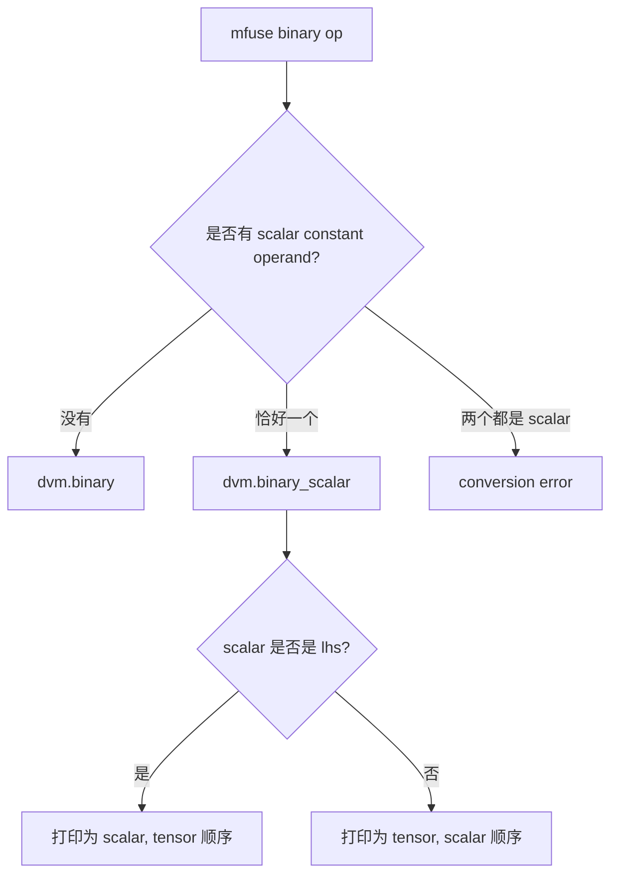

# 新增 dvm.binary_scalar 处理标量常量 Lowering

## 背景

在通过 inferrt 和 mfusion 运行 Qwen3 推理时，我们遇到了一个和 `torch.pow(x, 2)` 有关的 DVM lowering 问题。

模型脚本中的表达式很简单：

```python
torch.pow(x, 2)
```

FX graph 中，它被表示为一个 ATen tensor-scalar 算子：

```text
pow_1: "f32[1, 6, 2560]" = torch.ops.aten.pow.Tensor_Scalar(x, 2)
```

mfusion 将 fused subgraph lowering 到 DVM MLIR 之后，标量值 `2` 被表示成了一个 rank-0 tensor constant，并作为 `dvm.binary` 的 rhs 使用：

```mlir
%3 = dvm.constant dense<2> : tensor<i32>
%6 = dvm.binary Pow %5, %3
  : tensor<1x1x32x128xf32>, tensor<i32> -> tensor<1x1x32x128xf32>
```

这个问题暴露出 mfusion/inferrt 当前的 MLIR 表达方式和 DVM runtime API 之间存在不一致。

DVM 的 C++ `Binary` runtime API 原生支持 tensor-scalar 组合。scalar 参数支持 `float`、`Float16`、`BFloat16` 和 `int32_t`。DVM 开发者也提供了两个重要输入信息：

- 如果 binary 算子的两个入参都是 tensor，那么两个 tensor 的 dtype 应该保持一致，否则可能产生精度问题。
- 如果某个入参是 scalar，应该使用 runtime 的 scalar API，而不是把 scalar 表示成 rank-0 tensor。scalar 路径是 DVM 预期的接口形式，性能通常也更好。

此前的 lowering 没有在 DVM IR 中表达 tensor-tensor 和 tensor-scalar 的区别。它把 scalar constant 表示为 rank-0 tensor，并依赖后续 runtime 集成逻辑去 broadcast 或适配这个值。

## 现状

在本次改动之前，`DvmOps.td` 中的 `dvm.binary` 只建模了两个 operand 都是 tensor 的形式：

```mlir
dvm.binary <op> %lhs, %rhs : tensor<...>, tensor<...> -> tensor<...>
```

当 mfuse lowering 产生 scalar constant 时，下游 DVM runtime 集成代码会把这个 scalar 当作 rank-0 tensor 处理。如果 `dvm.binary` 两个输入 tensor 的 dtype 不一致，lowering 还需要插入 cast 或做类型提升。

这种方式有几个现实问题：

- IR 中难以看出这个 binary 操作的语义到底是 tensor-tensor 还是 tensor-scalar。
- 可能引入额外的 cast 和 broadcast。
- 如果遗漏了必要的 cast，可能产生难以定位的精度问题。
- 这种表达方式和 DVM runtime API 不一致，因为 runtime 已经有 scalar 特化实现，而 scalar 特化实现的性能通常更好。
- scalar 值被表达成 tensor value，会让后续维护更加脆弱。

## 目标

本设计有四个目标：

1. 在 DVM MLIR 中显式表达 tensor-scalar binary 操作。
2. 保留原始 binary 操作中 lhs/rhs 的逻辑顺序。
3. 停止在 DVM binary op lowering 中把 mfuse scalar constant 表示成 rank-0 tensor operand。
4. 建立一条后续 scalar-consuming op 都应遵循的 DVM scalar ABI 规则。

我们希望形成的规则是：

```text
mfuse scalar constant 不应以 rank-0 tensor operand 的形式逃逸到 DVM IR。
如果某个 DVM op 需要消费 scalar constant，应为这个 op 增加显式的 scalar 重载版本。
```

## 非目标

本次改动不试图一次性解决 DVM 中所有 scalar 使用场景。

具体来说：

- 不为所有 DVM op 增加 scalar 重载。
- 不保留 `dvm.constant` 作为仍被非 binary op 使用的 mfuse scalar constant 的 fallback 路径。
- 暂时不为 `dvm.binary` 或 `dvm.binary_scalar` 增加 result shape 或 result rank 校验（并非不重要，只是不是本次改动关注的重点）。

第一阶段实现聚焦 binary op，因为这是当前遇到的直接问题，并且 DVM 已经具备 tensor-scalar binary runtime API。

## 方案设计

新增一个 DVM op：

```mlir
dvm.binary_scalar
```

这个 op 表示一种 binary 操作：其中一个 operand 是 tensor SSA value，另一个 operand 是内联的 scalar attribute。

示例：

```mlir
%0 = dvm.binary_scalar Pow %x, 2
  : tensor<4xf32>, i32 -> tensor<4xf32>

%1 = dvm.binary_scalar Sub 0.0, %x
  : f32, tensor<4xf32> -> tensor<4xf32>
```

文本 IR 直接展示 tensor 和 scalar 在原始 binary 操作中的逻辑顺序。对于 `Sub`、`Div`、`Pow`、比较算子，以及未来任何依赖 lhs/rhs 顺序的 binary op，这一点都很重要。

op 内部存储以下信息：

- `op_type`：DVM binary 操作类型。
- `input`：tensor operand。
- `scalar`：scalar attribute。
- `scalar_on_lhs`：bool attribute，记录 scalar 是否是逻辑 lhs。
- `result`：结果 tensor。

打印 IR 时隐藏 `scalar_on_lhs`，而是根据它还原逻辑 operand 顺序。parser 做相反的事情：读取文本顺序，并据此设置 `scalar_on_lhs`。

这样可以保持 IR 可读：

```mlir
dvm.binary_scalar Sub 0.0, %x : f32, tensor<4xf32> -> tensor<4xf32>
```

而不是要求阅读者额外理解一个属性：

```mlir
dvm.binary_scalar Sub %x, 0.0 {scalar_on_lhs = true}
```

## Lowering 规则

mfuse-to-dvm conversion 将 binary op 分成三种情况：



预期 conversion 行为如下：

- Tensor-tensor binary op 继续 lowering 成 `dvm.binary`。
- Tensor-scalar 和 scalar-tensor binary op lowering 成 `dvm.binary_scalar`。
- Scalar-scalar binary op 被拒绝，因为 `dvm.binary_scalar` 这种 DVM binary 形式没有 tensor operand。

为了避免 conversion 顺序影响 binary scalar lowering，`mfuse.constant` 在 mfuse-to-dvm conversion 期间不会被标记为 illegal，也不会被单独的 conversion pattern 处理。它被允许作为临时 producer 留在 IR 中，让 binary conversion pattern 从它的 user 侧读取 scalar 值并内联到 `dvm.binary_scalar` attribute 中。

conversion 成功后，pass 会做一次 post-conversion cleanup：

- 如果残留的 `mfuse.constant` 是无 use 的 scalar constant，说明它已经被所有 scalar-aware consumer 内联消费，可以删除。
- 如果残留的 `mfuse.constant` 仍然有 user，说明某个 consumer op 尚未支持 scalar lowering，pass 会报错。
- 如果残留的是 non-scalar constant，pass 也会报错，因为 DVM conversion 不支持这种 constant。

如果 binary scalar lowering 之后，某个 scalar constant 仍然有非 binary user，conversion 最终会失败。这是有意设计。

报错应该引导 mfusion 项目开发者为剩余的 consumer op 增加 scalar 支持，而不是静默 fallback 到 rank-0 tensor constant。

需要特别说明的是，`dvm.binary_scalar` 只处理编译期可见的 direct scalar constant。mfuse-to-dvm 不会为了生成 `dvm.binary_scalar` 去追溯 `mfuse.cast`、block argument 或其它 producer。

例如 `mfuse.constant -> mfuse.cast -> mfuse.binary` 这类链路，应在 DVM cluster 之前由 canonicalize 将 scalar constant cast 折叠掉。真实 pipeline 中，cluster 之前的 canonicalize 会完成这个折叠，因此 outlined DVM function 不会看到 `constant -> cast` 这条链，也不会把 cast 后的 scalar 作为 fused block argument 传入。

如果某些非标准 pipeline 中仍然出现 scalar block argument，它已经不是当前 DVM outlined function 内的编译期常量。此时 mfuse-to-dvm 会把它当作 rank-0 tensor value 处理，binary op 会 lowering 成 `dvm.binary` 而不是 `dvm.binary_scalar`。这是可接受的 fallback，因为 `dvm.binary_scalar` 的目标不是覆盖所有 rank-0 scalar value，而是消除 mfuse scalar constant 在 DVM lowering 中逃逸成 rank-0 tensor operand 的情况。

## Scalar 类型

`dvm.binary_scalar` 支持 DVM binary scalar API 支持的 scalar 类型：

- `f32`
- `f16`
- `bf16`
- `i32`

op verifier 会拒绝不支持的 scalar attribute 类型，并在报错中列出支持的类型集合。

mfuse constant 可能以适合前端或 MLIR 表达的类型出现，但这些类型不一定能被 DVM scalar ABI 直接支持。例如，`torch.pow(x, 2)` 在进入 DVM lowering 之前，整数 scalar 可能表现为 `i64` constant。

conversion 将这种处理视为 DVM ABI 归一化步骤：

- `f32`、`f16`、`bf16` 和 `i32` 会被直接提取，不改变 dtype 或精度。
- `i1` 会被转换成 `i32` 的 `0/1`。这和 DVM Python API (dvm_py.h) 中 Python bool 通过 int 路径进入 C++ scalar ABI 的行为一致。
- `f64` 只有在值有限且可表示时，才允许转换成 `f32`，否则会报错。
- `i64` 只有在值位于 `i32` 范围内时，才允许转换成 `i32`，否则会报错。
- 其它类型会被拒绝并报错。

从受支持的 `DenseElementsAttr` 中提取 scalar attribute 的 helper 不应执行 dtype 转换。它的职责只是取出单个元素，并用相同 element type 包装成 `TypedAttr`。类型转换属于更高层的 DVM ABI 归一化逻辑。

需要区分两个层次：

- `dvm.binary_scalar` op 本身不接受 `i1` scalar attribute。
- mfuse-to-dvm 可以接受上游 `i1` scalar constant，但必须在生成 `dvm.binary_scalar` 之前把它归一化成 `i32 0/1`。

因此，DVM cluster 可以允许 `i1` scalar constant 进入 DVM outlined function。这个放开不意味着最终 DVM IR 支持 `i1` scalar attr，而是要求 conversion 负责把上游 bool scalar 转成 DVM C++ scalar ABI 支持的 `int32_t` 形式。

## 为什么不保留 dvm.constant fallback

保留 `dvm.constant` fallback 可以兼容已有的 scalar constant 被非 binary DVM op 消费的模式。但是，这也会让旧的歧义继续存在：scalar 值仍然可以作为 rank-0 tensor operand 逃逸到 DVM IR。

本次改动选择更严格的规则：

```text
不要把 rank-0 tensor constant 作为 mfuse scalar constant 在 DVM lowering 中的 fallback 表示。
```

这是一个有意的权衡：

- 兼容性会变得更严格。如果非 binary op 仍然消费 scalar constant，conversion 会失败。
- 失败点会指向这个 op 缺少 scalar lowering 路径。
- 后续 scalar consumer 应得到显式的 scalar-aware IR 或 lowering 支持，而不是继续依赖 rank-0 tensor 行为。

这样可以让 scalar 处理更加显式，并让 DVM IR 和 runtime ABI 保持一致。

## Verifier 范围

`dvm.binary` 会校验 tensor-tensor operands 的 element type 是否一致。

`dvm.binary_scalar` 会校验 scalar attribute 是否属于支持的 scalar 类型。

本次改动有意不在 verifier 中检查 result shape 或 result rank。这属于更宽泛的 DVM shape 语义决策，并不是解决 scalar constant lowering 问题所必需的内容。

## 兼容性和约束

本次改动影响 mfuse-to-dvm 边界，并且需要由 inferrt 等下游 DVM consumer 做对应适配。

重要的兼容性预期包括：

- mfusion 和 inferrt 中的 DVM dialect 定义应保持一致。
- runtime lowering 遇到 `dvm.binary_scalar` 时，应调用 DVM tensor-scalar binary API。
- legacy scalar broadcast 逻辑不应再用于新的 binary scalar 形式。
- 如果下游代码仍然期望 scalar constant 表示成 rank-0 tensor，需要进行更新。

这是一条更严格的 ABI 演进方向，而不是一次完全向后兼容的清理。

## 考虑过的替代方案

### 继续使用 dvm.constant 表示 rank-0 tensor

这是旧行为。它简单且兼容性好，但会把 scalar 语义隐藏在 tensor IR 后面。在 runtime 已经有 scalar 特化 API 的场景下，它还会引入 cast 和 broadcast 等额外处理。

这个方案被拒绝，因为它保留了精度问题和维护问题的根源。

### 扩展 dvm.binary，让它直接接受 tensor 或 scalar operand

另一种选择是把 `dvm.binary` 做成多态形式，允许 operand 既可以是 tensor，也可以是 scalar。

这个方案被拒绝，因为它会让现有 op 的语义变得不够精确。tensor-tensor 和 tensor-scalar 有不同的 runtime 路径，也有不同的校验关注点，用两个 op 分别表达会更清晰。

### 把 scalar_on_lhs 作为显式 IR 属性打印出来

初版设计曾考虑只打印 tensor operand 和 scalar attribute，同时显式打印 `scalar_on_lhs` 属性。

这个方案被拒绝，因为它降低了 IR 可读性。最终选择的 assembly format 会直接展示逻辑 operand 顺序，并把 `scalar_on_lhs` 保留为内部表示细节。

### 在 conversion pattern 中转换 mfuse.constant

另一个实现选择是为 `mfuse.constant` 注册 conversion pattern，在 pattern 中删除无 use 的 scalar constant，并对仍有 user 的 scalar constant 报错。

这个方案后来被简化掉了。原因是 dialect conversion 的 rewrite 顺序会影响 producer 和 consumer 谁先被处理：如果 `mfuse.constant` producer 先被处理，就可能抢在 binary user 之前报错，使 binary scalar lowering 没有机会消费它。

最终实现选择让 `mfuse.constant` 在 conversion 阶段作为临时合法 producer 保留，并在 `applyPartialConversion` 成功后统一扫描清理或报错。这样职责更清晰，也不依赖 conversion 过程中的瞬时 user 状态。

## 测试策略

测试应覆盖：

- `dvm.binary_scalar` 中 scalar 在 rhs 时的 parse/print。
- `dvm.binary_scalar` 中 scalar 在 lhs 时的 parse/print。
- 支持的 scalar 类型：`f32`、`f16`、`bf16` 和 `i32`。
- 不支持 scalar 类型时的拒绝逻辑。
- tensor-scalar binary op 从 mfuse-to-dvm lowering 到 `dvm.binary_scalar`。
- 非交换场景下 scalar 在 lhs 的情况，例如 `scalar - tensor` 和 `scalar / tensor`。
- scalar-scalar binary lowering 被拒绝。
- 既有 tensor-tensor binary 继续通过 `dvm.binary` lowering。

## 后续工作

未来工作应继续遵循相同的 scalar ABI 规则：

- 如果另一个 DVM op 需要消费 scalar constant，应为这个 op 增加显式的 scalar lowering 支持。
- 不要增加一个宽泛 fallback，把 mfuse scalar constant lowering 成 rank-0 DVM tensor。
- 保持 mfusion 与下游 DVM dialect/runtime consumer 对齐。

如果真实模型需要，后续可以为 broadcast-like 或 fill-like 等 op 增加 scalar-aware 形式。

## 相关代码

- `include/mfusion/Dialect/Dvm/IR/DvmOps.td`
- `lib/Dialect/Dvm/IR/DvmOps.cc`
- `lib/Conversion/MfuseToDvm/MfuseToDvm.cc`
- `tests/ut/lit/Conversion/MfuseToDvm/`
