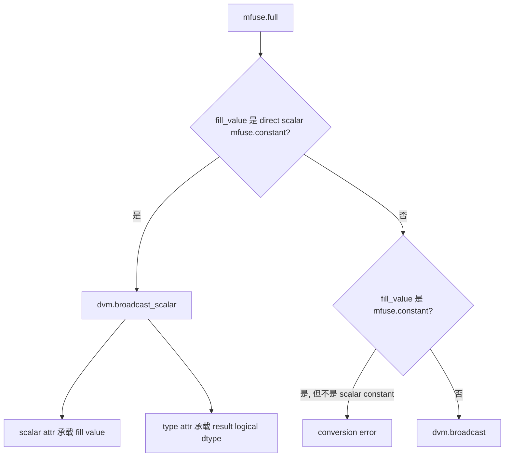

# 新增 dvm.broadcast_scalar 处理 mfuse.full Lowering

## 背景

在为 `dvm.binary_scalar` 建立 DVM scalar ABI 规则之后，mfuse-to-dvm conversion 开始在 pass 末尾检查 outlined DVM function 中是否仍有残留的 `mfuse.constant`。

这条规则的目标是明确的：

```text
mfuse scalar constant 不应以 rank-0 tensor operand 的形式逃逸到 DVM IR。
如果某个 DVM op 需要消费 scalar constant，应为这个 op 增加显式的 scalar lowering 路径。
```

这让 binary scalar 的问题得到了约束，但也暴露了另一个合法的 scalar consumer：`mfuse.full`。

典型 IR 如下：

```mlir
%cst = mfuse.constant dense<1.0> : tensor<f32, {is_scalar = ""}>
%0 = mfuse.full %cst : (tensor<f32, {is_scalar = ""}>) -> tensor<4x4xf32>
```

`mfuse.full` 的语义是用一个 scalar fill value 创建指定 shape 的 tensor。它天然会消费 scalar constant。如果 mfuse-to-dvm 没有为它提供 scalar-aware lowering，那么 post-conversion cleanup 会看到 `%cst` 仍然被 `mfuse.full` 使用，并报错。

这不是 cleanup 过严，而是说明 `mfuse.full` 需要像 binary op 一样获得显式的 DVM scalar lowering 支持。

## 外部输入信息

DVM runtime 已经提供了 scalar broadcast API：

```cpp
template <typename T>
NDObject *Broadcast(T val, IntArrayRef *shape, DataType type);
```

根据 `dvm.h`，该 API 的 scalar value 支持：

- `float`
- `int32_t`
- `Float16`
- `BFloat16`
- `ScalarRef *`

同时，`dvm_py.h` 中的 `Full` 方法提供了非常有价值的参考：

```cpp
if (py::isinstance<py::bool_>(scalar)) {
  op = kernel_.Broadcast(static_cast<int>(scalar.cast<bool>()), shape_ref, dtype);
} else if (py::isinstance<py::int_>(scalar)) {
  op = kernel_.Broadcast(scalar.cast<int>(), shape_ref, dtype);
} else if (py::isinstance<py::float_>(scalar)) {
  op = kernel_.Broadcast(scalar.cast<float>(), shape_ref, dtype);
} else if (py::isinstance<ScalarRefPy>(scalar)) {
  op = kernel_.Broadcast(PyToScalar(scalar), shape_ref, dtype);
}
```

这里有两个关键点：

- scalar value 的 C++ 类型和输出 tensor 的 logical dtype 是两个维度。
- bool fill value 在 Python binding 中通过 `int` 路径传给 DVM Broadcast，logical dtype 仍由 `dtype` 参数决定。

因此，DVM MLIR 也应该把 scalar value 和 logical output dtype 分开表达。

## 现状

本次改动之前，DVM dialect 中已有 `dvm.broadcast`：

```mlir
dvm.broadcast %input shape [4, 4]
  : tensor<f32> -> tensor<4x4xf32>
```

它表示 tensor value broadcast，适合处理 SSA value 输入，例如 rank-0 tensor block argument。

但它不适合表达编译期 scalar constant：

```mlir
%cst = mfuse.constant dense<1.0> : tensor<f32, {is_scalar = ""}>
%0 = mfuse.full %cst : (tensor<f32, {is_scalar = ""}>) -> tensor<4x4xf32>
```

这里有一个容易想到的旧式 lowering 方式：先把 scalar constant 降成一个 rank-0 tensor，再让 `dvm.broadcast` 去 broadcast 这个 tensor。

```mlir
%cst = dvm.constant dense<1.0> : tensor<f32>
%0 = dvm.broadcast %cst shape [4, 4]
  : tensor<f32> -> tensor<4x4xf32>
```

这种 IR 可以在一部分场景下 work，但它表达的是另一个含义：`dvm.broadcast` 的输入是一个 tensor value。阅读这段 IR 时，只能看到“把一个 rank-0 tensor broadcast 成目标 shape”，看不到原始语义其实是“用编译期常量 `1.0` 填充一个新 tensor”。

这会带来职责倒置。mfuse-to-dvm 已经知道 `%cst` 是 `mfuse.full` 的 scalar fill value，却没有在 DVM IR 中把它表达出来，而是把它伪装成一个普通 tensor operand。后续 runtime lowering 如果想调用 DVM 的 `Broadcast(scalar, shape, dtype)` API，就必须再反过来追溯这个 tensor operand，判断它是不是来自 scalar constant，然后把它重新还原成 scalar 参数。

换句话说，scalar 信息在 mfuse-to-dvm 阶段被丢进 rank-0 tensor 表达里，到了 runtime lowering 阶段又要被猜回来。这种隐式约定正是我们想避免的维护风险。

因此，本次设计不把编译期可见的 `mfuse.constant` fill value 降成 `dvm.constant + dvm.broadcast`。它应该直接进入 `dvm.broadcast_scalar` 的 scalar attribute，让 DVM IR 明确表达“这是 scalar fill value”，并和 DVM runtime 的 `Broadcast(scalar, shape, dtype)` API 对齐。

这还有性能上的考虑。DVM runtime 已经为 scalar value 提供了专门的 Broadcast 重载，通常可以少走 rank-0 tensor 创建、tensor operand 处理和额外适配逻辑，因此比把 scalar 包装成 rank-0 tensor 再 broadcast 的路径更合适，性能也通常会更好一点。

这与 `dvm.binary_scalar` 引入后建立的 scalar ABI 规则冲突。

## 目标

本设计的目标是：

1. 为 `mfuse.full` 的 scalar constant fill value 提供显式 DVM lowering。
2. 使用 DVM runtime 的 scalar broadcast API，而不是 rank-0 tensor fallback。
3. 支持 `dvm_py.h::Full` 中已经存在的 bool fill value 处理方式。
4. 保留非 constant fill value 的 tensor broadcast 路径。
5. 继续维护“mfuse scalar constant 不逃逸成 rank-0 tensor operand”的规则。

## 非目标

本次改动不试图解决所有 DVM broadcast 相关问题：

- 不改变 `dvm.broadcast` 的 tensor value 语义。
- 不支持把任意 producer 追溯折叠成 scalar attribute。
- 不引入 `dvm.constant` fallback。
- 不为所有 DVM op 增加 scalar 重载。
- 不实现 `ScalarRef *` 形式的 MLIR 表达。

第一阶段只覆盖 `mfuse.full` 的 direct scalar constant fill value，因为这是当前 cleanup 规则下暴露出的实际缺口。

## 方案设计

新增一个 DVM op：

```mlir
dvm.broadcast_scalar
```

它表示“用一个内联 scalar attribute 创建指定 shape 和 dtype 的 tensor”。

示例：

```mlir
%0 = dvm.broadcast_scalar 1.000000e+00 shape [4, 4] type Float32
  : f32 -> tensor<4x4xf32>

%1 = dvm.broadcast_scalar 1 shape [4, 4] type Bool
  : i32 -> tensor<4x4xi1>
```

op 内部存储：

- `scalar`：scalar attribute，表示传给 DVM scalar broadcast API 的 C++ scalar value。
- `shape`：目标 shape。
- `type`：DVM logical output dtype。
- `result`：输出 tensor type。

`scalar` 和 `type` 被有意分开，因为 DVM runtime 的 `Broadcast(val, shape, dtype)` 本身也是这种接口形态。

## Lowering 规则

`mfuse.full` lowering 分为三类：



具体规则如下：

- 如果 `fill_value` 是带 `is_scalar` marker 的 direct `mfuse.constant`，则 lowering 成 `dvm.broadcast_scalar`。
- 如果 `fill_value` 是 `mfuse.constant`，但不是 scalar constant，则报错。
- 如果 `fill_value` 不是 constant，例如 rank-0 tensor block argument，则 lowering 成 `dvm.broadcast`。

最后一条非常重要。`dvm.broadcast_scalar` 只表示编译期可见的 scalar attribute；它不是所有 rank-0 tensor value 的替代品。

例如：

```mlir
func.func @main(%arg0: tensor<f32>) -> tensor<4xf32>
    attributes {mfusion.outlined, mfusion.fusion_type = "dvm"} {
  %0 = mfuse.full %arg0 : (tensor<f32>) -> tensor<4xf32>
  return %0 : tensor<4xf32>
}
```

这里 `%arg0` 是运行时传入的 rank-0 tensor value，不是编译期 constant。它应继续走 tensor broadcast：

```mlir
%0 = dvm.load %arg0 : tensor<f32> -> tensor<f32>
%1 = dvm.broadcast %0 shape [4] : tensor<f32> -> tensor<4xf32>
```

这样可以同时满足两个要求：

- 编译期 scalar constant 不逃逸成 rank-0 tensor。
- 运行时 rank-0 tensor value 仍然有合法的 tensor broadcast 表达。

## Scalar 和 dtype 规则

`dvm.broadcast_scalar` 的 scalar attribute 支持：

- `f32`
- `f16`
- `bf16`
- `i32`

logical output dtype 由 `type` attribute 表达，来自 result tensor element type：

- `tensor<...xi1>` -> `Bool`
- `tensor<...xf16>` -> `Float16`
- `tensor<...xbf16>` -> `BFloat16`
- `tensor<...xf32>` -> `Float32`
- `tensor<...xi32>` -> `Int32`
- `tensor<...xi64>` -> `Int64`

需要注意，scalar attr type 不一定等于 result element type。原因是 DVM runtime 的 scalar value 类型和 output dtype 本来就是分开的。

典型例子：

```mlir
%0 = dvm.broadcast_scalar 1 shape [2] type Bool
  : i32 -> tensor<2xi1>

%1 = dvm.broadcast_scalar 5.000000e-01 shape [2] type Bool
  : f32 -> tensor<2xi1>
```

这两种形式都符合 DVM runtime 的接口模型。第一个例子对应 bool 或 int scalar value，第二个例子对应 float scalar value；logical output dtype 都由 `type Bool` 决定。

当 DVM runtime 收到 `Broadcast(float_value, shape, kBool)` 时，会先按 `kFloat16` 生成 scalar broadcast，再 cast 到 bool（参考 dvm 开源项目中的 dvm/src/dvm.cc）。
因此，`type Bool` 并不要求 scalar attr 必须是 `i32`。只有当输入 scalar constant 本身是 `i1` 时，mfuse-to-dvm 才会把它归一化成 `i32` 的 `0/1`，因为 DVM scalar Broadcast API 没有 bool 模板参数。

## Scalar 归一化

`mfuse.full` 的 fill value 可能来自前端或 Torch lowering，类型不一定直接等于 DVM scalar API 支持的 C++ 类型。

conversion 会做 DVM ABI 归一化：

- `f32`、`f16`、`bf16`、`i32`：直接提取为同类型 `TypedAttr`。
- `i1`：转换成 `i32` 的 `0/1`。这和 DVM Python API (dvm_py.h) 中 Python bool 通过 int 路径进入 C++ scalar ABI 的行为一致。
- `f64`：仅当值有限且可表示为 `f32` 时，转换成 `f32`。
- `i64`：仅当值位于 `i32` 范围内时，转换成 `i32`。
- 其它类型：报错。

这部分逻辑和 binary scalar normalization 共享底层 helper。共享规则是：

- `dvm.binary_scalar` 和 `dvm.broadcast_scalar` 都不直接接受 `i1` scalar attribute。
- mfuse-to-dvm 可以接受上游 `i1` scalar constant，但必须先转换成 `i32 0/1`，再作为 DVM scalar op 支持的 scalar attr 使用。
- `dvm.broadcast_scalar` 额外支持 bool result dtype。float 或 int scalar constant 仍按自身 scalar 类型归一化，再由 `type Bool` 指定输出 dtype。

共享 helper 可以避免 f64/i64 降级逻辑在不同 scalar consumer 之间分叉，同时保留各自 ABI 的差异。

## Verifier 范围

`dvm.broadcast_scalar` verifier 关注以下内容：

- scalar attribute type 必须属于支持集合：`f32`、`f16`、`bf16`、`i32`。
- `type` attribute 必须和 result tensor element type 匹配。
- `shape` attribute 必须和 result tensor shape 一致。

其中 `shape` 校验是必要的，因为 `dvm.broadcast_scalar` 没有 tensor operand 可以从中推导 broadcast 结果，`shape` 和 result type 是同一语义的两种表达。如果两者不一致，IR 本身就是矛盾的。

## 为什么不复用 dvm.broadcast

一种替代方案是继续把 `mfuse.constant` 表示成 rank-0 tensor，然后 lowering 成：

```mlir
%cst = dvm.constant dense<1.0> : tensor<f32>
%0 = dvm.broadcast %cst shape [4, 4]
```

这个方案被拒绝，原因和 `dvm.binary_scalar` 中拒绝 `dvm.constant` fallback 一致：

- 它让 scalar constant 继续以 tensor value 形式逃逸。
- 它没有表达 DVM runtime 的 scalar API。
- 它会让后续每个 scalar consumer 都继续依赖 rank-0 tensor 兼容逻辑。
- 它削弱了 post-conversion cleanup 对 scalar ABI 的约束能力。

`dvm.broadcast` 仍然存在，但它用于 tensor value broadcast，不用于编译期 scalar constant lowering。

## 为什么不把 full 直接降成 dvm.constant

另一个可能方案是为 `mfuse.full` 生成某种 tensor constant。但这不适合作为通用方案：

- `mfuse.full` 的 result shape 可能较大，展开成 dense tensor constant 不现实。
- DVM runtime 已经提供 scalar broadcast API，没有必要在 IR 中物化完整 tensor。
- 这会把一个运行时可以高效表达的 scalar fill 操作变成潜在的大常量。

因此，`dvm.broadcast_scalar` 是更接近 runtime API 的表达。

## 非 constant fill value 的处理

本设计没有把所有 rank-0 tensor 都强行转成 scalar attr。

如果 `fill_value` 不是 `mfuse.constant`，它可能是：

- DVM outlined function 的 block argument。
- 某个 runtime tensor op 的结果。
- 非标准 pipeline 中保留下来的 rank-0 tensor value。

这些值不是编译期常量，不能安全内联成 attribute。它们应继续走 `dvm.broadcast`。

这也是 `ConvertFullOp` 中需要区分三种情况的原因：

```text
scalar mfuse.constant      -> dvm.broadcast_scalar
non-scalar mfuse.constant  -> error
non-constant tensor value  -> dvm.broadcast
```

其中 non-scalar `mfuse.constant` 报错是为了避免它绕过 scalar ABI 规则，作为 rank-0 tensor fallback 混入 DVM IR。

## 兼容性和约束

这个改动继续推进 DVM scalar ABI 的收敛：

- mfusion 和下游 DVM dialect 定义需要同步新增 `dvm.broadcast_scalar`。
- runtime lowering 应把 `dvm.broadcast_scalar` 映射到 DVM scalar broadcast API。
- legacy 的 `mfuse.constant -> rank-0 tensor -> dvm.broadcast` 路径不应作为 scalar constant fallback 继续保留。
- 如果后续发现新的 op 消费 scalar constant，应为该 op 增加明确的 scalar lowering，而不是恢复 `dvm.constant` fallback。

这一策略会让 conversion 对 unsupported scalar consumer 更严格，但失败会更早、更明确，也更符合 DVM runtime 的真实 ABI。

## 与 dvm.binary_scalar 的关系

`dvm.broadcast_scalar` 是 `dvm.binary_scalar` 之后的同一条设计原则的延伸。

两者共同表达了一个规则：

```text
DVM IR 应区分 tensor value 和 scalar constant。
scalar constant 应进入 op-specific scalar attribute，而不是退化成 rank-0 tensor operand。
```

不同点在于：

- `dvm.binary_scalar` 需要保留 scalar 在 lhs/rhs 中的逻辑顺序。
- `dvm.broadcast_scalar` 没有 lhs/rhs 顺序问题，但需要同时表达 shape 和 logical output dtype。
- 两者的 scalar attribute 都不直接支持 `i1`；上游 `i1` scalar constant 会在 mfuse-to-dvm 中先归一化为 `i32 0/1`。
- `dvm.broadcast_scalar` 支持 bool result dtype，并允许 `f32`、`f16`、`bf16`、`i32` scalar value 与 `type Bool` 组合。

后续如果继续扩展 DVM scalar consumer，应优先复用这两个设计经验：显式 scalar op、scalar attr 内联、logical dtype 分离、conversion 末尾清理残留 scalar constant。
