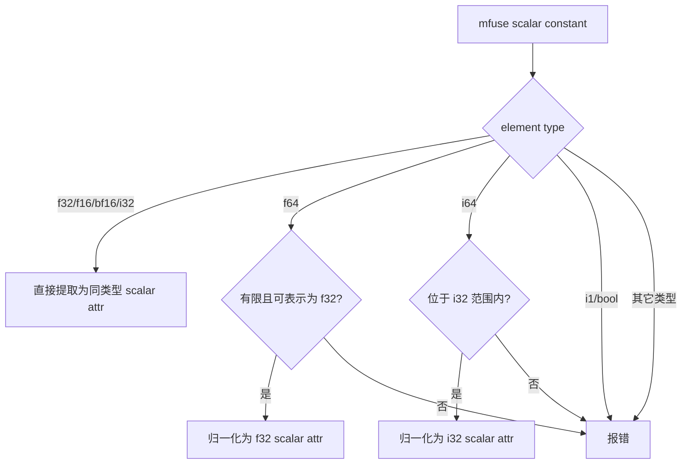

# 回退 DVM scalar op 对 i1 bool 标量的适配

## 背景

在新增 `dvm.binary_scalar` 和 `dvm.broadcast_scalar` 后，mfuse-to-dvm 建立了一条新的 DVM scalar ABI 规则：

```text
mfuse scalar constant 不应以 rank-0 tensor operand 的形式逃逸到 DVM IR。
如果某个 DVM op 需要消费 scalar constant，应为这个 op 增加显式的 scalar lowering 路径。
```

这个规则最初主要解决 `torch.pow(x, 2)` 这类 tensor-scalar binary op 的 lowering 问题。后来 `mfuse.full` 也暴露出同类问题，因此新增了 `dvm.broadcast_scalar`。

在实现 `dvm.broadcast_scalar` 的过程中，我们曾进一步尝试支持 `i1` (bool) scalar constant：

- DVM cluster 允许 `mfuse.constant dense<true> : tensor<i1, {is_scalar = ""}>` 作为安全的 scalar constant 进入 DVM cluster。
- `mfuse-to-dvm` 在生成 `dvm.binary_scalar` 或 `dvm.broadcast_scalar` 前，把 `i1` scalar constant 归一化成 `i32 0/1`。
- lit 用例中增加了手写 `i1` scalar constant 被 binary/full 消费的 positive case。

后续结合真实 Torch pipeline、DVM ABI 和 cluster 行为重新分析后，我们决定回退这部分适配。

## 最初为什么考虑支持 i1

支持 `i1` scalar constant 的动机来自两个观察：

1. 上游 IR 中理论上可以手写出 `mfuse.constant dense<true> : tensor<i1, {is_scalar = ""}>`。
2. DVM Python API 的 `Full` 路径中，Python bool 会被转换成 `int` 后调用 DVM Broadcast：

```cpp
if (py::isinstance<py::bool_>(scalar)) {
  op = kernel_.Broadcast(static_cast<int>(scalar.cast<bool>()), shape_ref, dtype);
}
```

因此，我们曾经推断：如果 mfuse 中出现 `i1` scalar constant，也可以在 mfuse-to-dvm 中做同样的 `bool -> i32 0/1` 归一化。

这个推断在手写 IR 上可以工作，但它把“上游是否真的会产生 `i1` scalar constant”和“DVM scalar ABI 是否应该接收 bool scalar”混在了一起。

## 最新实测结论

真实 Torch pipeline 中，`torch.full(..., True, dtype=...)` 不会直接进入 mfuse 成为 `i1` scalar constant。

示例 Python：

```python
def forward(self, a):
    return a + torch.full((2, 2), True, dtype=a.dtype, device="npu")
```

torch-mlir 会先插入 `torch.aten.Int.bool`：

```mlir
%true = torch.constant.bool true
%1 = torch.aten.Int.bool %true : !torch.bool -> !torch.int
%2 = torch.aten.full %size, %1, ...
```

随后 torch-to-mfuse 看到的是 int scalar，而不是 bool scalar：

```mlir
%0 = mfuse.constant dense<1> : tensor<i64, {is_scalar = ""}>
%2 = mfuse.full %0 : (tensor<i64, {is_scalar = ""}>) -> tensor<2x2xf32>
```

也就是说，当前正常上游路径已经在 torch-mlir 阶段把 bool fill value 转成 `torch.int`。mfuse-to-dvm 只需要处理 `i64 0/1 -> i32 0/1` 这类已有的数值 scalar 归一化，不需要额外支持 `i1 -> i32`。

## 回退原因

### 1. DVM scalar ABI 不支持 bool scalar value

DVM C++ scalar API 的直接支持范围是：

- `float`
- `int32_t`
- `Float16`
- `BFloat16`
- `ScalarRef *`

`i1` / bool 不是 DVM scalar value ABI 的一等类型。`dvm.binary_scalar` 和 `dvm.broadcast_scalar` 的 scalar attribute 应保持在这组 ABI 类型上。

需要注意，`dvm.broadcast_scalar` 支持 bool tensor result：

```mlir
%0 = dvm.broadcast_scalar 1 shape [2] type Bool
  : i32 -> tensor<2xi1>
```

这里的 `Bool` 是 result logical dtype，不是 filled value 的 scalar type。不能因为 result 是 `tensor<...xi1>`，就认为 scalar attr 可以是 `i1`。

### 2. 当前上游不会产生需要支持的 i1 scalar constant

对 `torch.full(..., True, dtype=...)` 的实测说明，bool fill value 在 torch-mlir 中已经经过 `torch.aten.Int.bool`，进入 mfuse 时是 `i64` scalar constant。

因此，支持 `i1` scalar constant 不是当前真实 pipeline 的需求，而是对手写 IR 的额外扩展。

### 3. 放开 DVM cluster 的 i1 scalar 会引入额外复杂度

如果 DVM cluster 允许 `i1` scalar constant，那么 consumer op 可能被判定为 DVM-clusterable。但通用 cluster 构造逻辑中，bool `DenseElementsAttr` 过去会被过滤，不一定被克隆进 fused body。

这样会出现下面的问题：

```mlir
// 期望：constant 被克隆进 fused body
%fused = mfuse.fused %arg0, %arg1 {
  %cst = mfuse.constant dense<true> : tensor<i1, {is_scalar = ""}>
  %0 = mfuse.add %arg0, %cst ...
}

// 实际风险：constant 作为外部 block argument 传入 fused body
%cst = mfuse.constant dense<true> : tensor<i1, {is_scalar = ""}>
%fused = mfuse.fused %arg0, %cst, %arg1 {
  ^bb0(%x: tensor<...>, %c: tensor<i1, {is_scalar = ""}>, ...)
  %0 = mfuse.add %x, %c ...
}
```

后一种形式会让 mfuse-to-dvm 看不到 direct `mfuse.constant`，也就无法做 `i1 -> i32 0/1` 的常量归一化。要继续支持这条路，就必须进一步调整 constant collection、cluster legality 和 conversion 的契约。

考虑到真实上游并不产生这种 `i1` scalar constant，这部分复杂度没有必要。

### 4. 手写 i1 positive 用例会误导 ABI 边界

保留 `i1` scalar positive 用例，会让后续维护者误以为 DVM scalar ABI 支持 bool scalar value。实际我们希望表达的是：

```text
DVM scalar value ABI 支持 f32/f16/bf16/i32。
f64/i64 可以在 mfuse-to-dvm 中安全归一化成 f32/i32。
i1/bool 不是 DVM scalar value ABI 类型。
```

因此，手写 `i1` scalar constant 被 `dvm.binary_scalar` 或 `dvm.broadcast_scalar` 接收的 positive case 应回退为负向用例。

## 最终规则

回退后，DVM scalar lowering 的规则如下：



适用于：

- `dvm.binary_scalar`
- `dvm.broadcast_scalar`

其中 `dvm.broadcast_scalar` 仍支持 bool tensor result：

```mlir
%0 = dvm.broadcast_scalar 1 shape [2] type Bool
  : i32 -> tensor<2xi1>
```

但不支持 bool scalar filled value：

```mlir
// 不支持
%0 = dvm.broadcast_scalar true shape [2] type Bool
  : i1 -> tensor<2xi1>
```

## 回退范围

本次回退包括：

- DVM cluster 不再把 `i1` scalar constant 视为 DVM-supported scalar constant。
- `dvm.binary_scalar` lowering 不再接受 `i1` scalar constant，也不再执行 `i1 -> i32 0/1`。
- `dvm.broadcast_scalar` lowering 不再接受 `i1` scalar constant，也不再执行 `i1 -> i32 0/1`。
- 删除或修改手写 `i1` scalar positive lit 用例。
- 增加负向用例，明确 `i1` scalar constant 会在 conversion 阶段报错。

## 如果未来需要支持 i1

如果后续上游确实决定引入 `mfuse.constant dense<true> : tensor<i1, {is_scalar = ""}>`，并且这种值会传给 DVM scalar op，那么不应直接把 `i1` 暴露给 DVM op。

更合适的做法是：

1. 在进入 DVM scalar op 之前，明确执行 `i1 -> i32 0/1` 的归一化。
2. 同步更新 DVM cluster 的 legality 规则。
3. 同步更新 fused body constant collection，确保 direct scalar constant 不会变成外部 block argument。
4. 增加覆盖 cluster -> outline -> mfuse-to-dvm 的端到端 lit 用例。

只有这些契约同时成立，才能重新考虑支持上游 `i1` scalar constant。否则应继续保持当前规则：bool tensor result 可以支持，bool scalar value 不进入 DVM scalar ABI。
